# Учебник по астрономии. Тема 1

## Единство мира. Природа Солнечной системы (*Układ Słoneczny*). Земля (*Ziemia*) — планета. Луна (*Księżyc*) — естественный спутник (*naturalny satelita*)

---

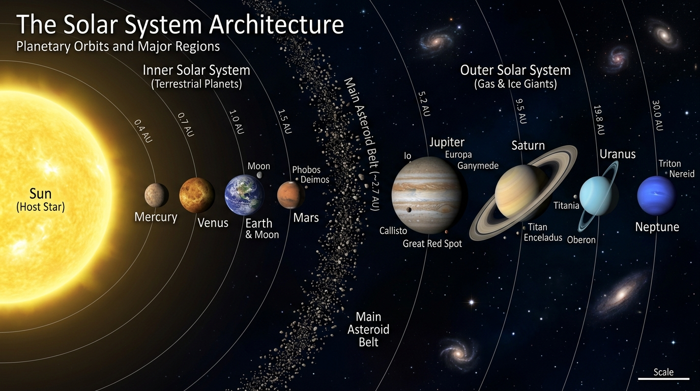

---

### 1. Строение Солнечной системы — *Budowa Układu Słonecznego* (O)

**Солнечная система (*Układ Słoneczny*)** — это гравитационно связанная планетная система (*układ planetarny*), состоящая из центральной звезды — Солнца (*Słońce*) — и всех обращающихся вокруг него по гелиоцентрическим орбитам небесных тел:

* **Солнце (*Słońce*)** — центральное массивное тело системы, сосредоточившее $99{,}86\%$ всей массы Солнечной системы:
  $$\mathbf{M_\odot \approx 1\,988\,500\,000\,000\,000\,000\,000\,000\,000\,000\text{ кг}} \quad (1{,}9885 \cdot 10^{30}\text{ кг})$$
* **8 главных планет (*8 planet*)** — классические планеты, движущиеся по эллиптическим гелиоцентрическим орбитам, близким к круговым.
* **Естественные спутники планет (*naturalne satelity planet*)** — небесные тела, обращающиеся вокруг планет по околопланетным орбитам.
* **Карликовые планеты (*planety karłowate*)** — объекты гидростатического равновесия, не расчистившие свою орбиту (например, Плутон — *Pluton*, Церера — *Ceres*, Эрида — *Eris*).
* **Малые тела Солнечной системы**:
  * **Астероиды (*planetoidy / asteroidy*)** — каменистые малые тела в Главном поясе астероидов (*pas planetoid*) между Марсом и Юпитером ($2{,}1\text{--}3{,}3\text{ au}$).
  * **Кометы (*komety*)** — ледяные малые тела из пояса Койпера (*pas Kuipera*) и облака Оорта (*obłok Oorta*).
  * **Метеороиды (*meteoroidy*)**, метеоры (*meteory*) и метеориты (*meteoryty*).
  * **Межпланетное вещество (*materia międzyplanetarna*)** и солнечный ветер (*wiatr słoneczny*).

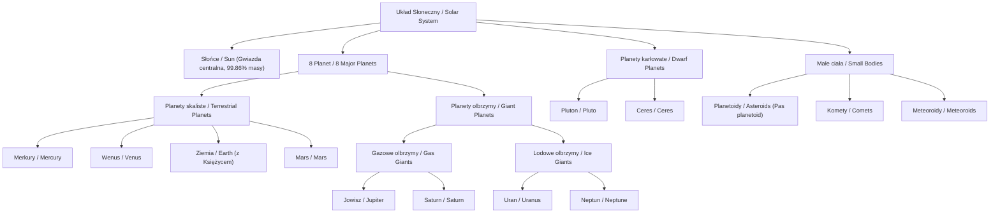

---

#### 2.1. Сводная физическая таблица планет Солнечной системы

Точные значения масс (в точных числах и научной нотации), радиусов, плотностей и ускорений свободного падения:

| Небесное тело | Название по-польски | Масса $M$ (в точных числах кг) | Масса $M / M_\oplus$ | Средний радиус $R$ (км) | Плотность $\rho$ (г/см³) | Ускорение $g$ (м/с²) |
| :--- | :--- | :---: | :---: | :---: | :---: | :---: |
| **Солнце** | *Słońce* | $1\,988\,500\,000\,000\,000\,000\,000\,000\,000\,000$ | $332\,946$ | $696\,340$ | $1{,}408$ | $274{,}0$ |
| **Меркурий** | *Merkury* | $330\,110\,000\,000\,000\,000\,000\,000$ | $0{,}0553$ | $2439{,}7$ | $5{,}427$ | $3{,}70$ |
| **Венера** | *Wenus* | $4\,867\,500\,000\,000\,000\,000\,000\,000$ | $0{,}8150$ | $6051{,}8$ | $5{,}243$ | $8{,}87$ |
| **Земля** | *Ziemia* | $\mathbf{5\,972\,200\,000\,000\,000\,000\,000\,000}$ | $\mathbf{1{,}0000}$ | $\mathbf{6371{,}0}$ | $\mathbf{5{,}515}$ | $\mathbf{9{,}81}$ |
| **Марс** | *Mars* | $641\,710\,000\,000\,000\,000\,000\,000$ | $0{,}1074$ | $3389{,}5$ | $3{,}933$ | $3{,}71$ |
| **Юпитер** | *Jowisz* | $1\,898\,200\,000\,000\,000\,000\,000\,000\,000$ | $317{,}83$ | $69911$ | $1{,}326$ | $24{,}79$ |
| **Сатурн** | *Saturn* | $568\,340\,000\,000\,000\,000\,000\,000\,000$ | $95{,}16$ | $58232$ | $0{,}687$ | $10{,}44$ |
| **Уран** | *Uran* | $86\,810\,000\,000\,000\,000\,000\,000\,000$ | $14{,}54$ | $25362$ | $1{,}270$ | $8{,}69$ |
| **Нептун** | *Neptun* | $102\,410\,000\,000\,000\,000\,000\,000\,000$ | $17{,}15$ | $24622$ | $1{,}638$ | $11{,}15$ |
| **Луна (спутник)**| *Księżyc* | $73\,420\,000\,000\,000\,000\,000\,000$ | $0{,}0123$ ($\frac{1}{81,3}$) | $1737{,}1$ | $3{,}344$ | $1{,}62$ |

---

### 3. Основные географические понятия и Высота объекта над горизонтом — *Podstawy geografii* (O)

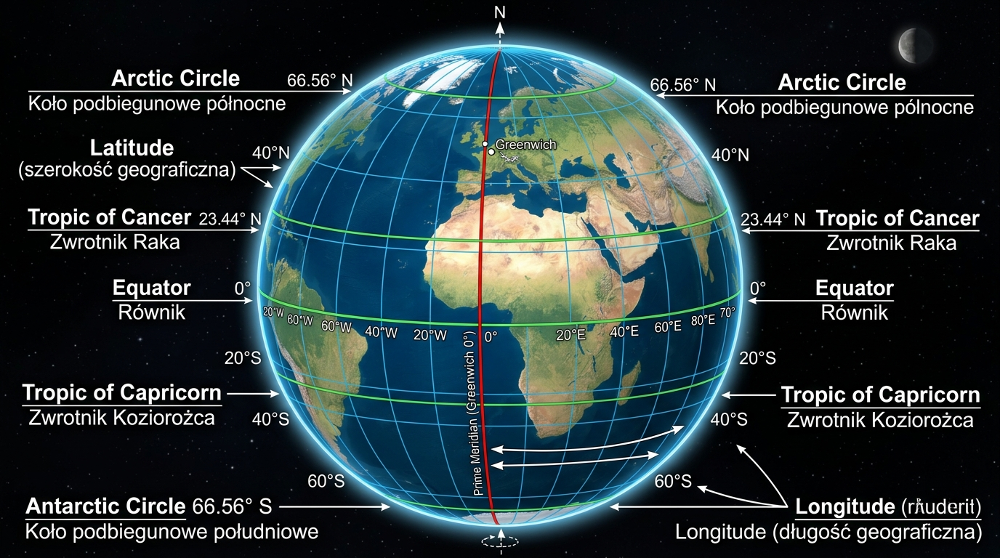

Для описания положения объектов на Земле и на небесной сфере используется градусная сетка координат:

* **Географическая широта (*szerokość geograficzna*, $\varphi$)**: Угловое расстояние от экватора к северу ($\text{N}$, $+0^\circ\text{--}90^\circ$) или к югу ($\text{S}$, $-0^\circ\text{--}90^\circ$).
* **Географическая долгота (*długość geograficzna*, $\lambda$)**: Угловое расстояние от начального (Гринвичского) меридиана к востоку ($\text{E}$, $+0^\circ\text{--}180^\circ$) или к западу ($\text{W}$, $-0^\circ\text{--}180^\circ$).

#### 3.1. Характерные параллели и регионы Земли

| Географический объект | Польский термин | Широта $\varphi$ | Астрономический и климатический смысл |
| :--- | :--- | :---: | :--- |
| **Экватор** | *Równik* | $0^\circ$ | Делит Землю на **Северное полушарие (*półkula północna*)** и **Южное полушарие (*półkula południowa*)**. День всегда равен ночи ($12\text{ ч}$). |
| **Тропик Рака (Северный тропик)** | *Zwrotnik Raka* | $+23^\circ 26' \text{ N} \ (\approx 23{,}44^\circ\text{ N})$ | Самая северная широта, где Солнце находится в зените ($h_\odot = 90^\circ$) в день летнего солнцестояния (20–21 июня). |
| **Тропик Козерога (Южный тропик)** | *Zwrotnik Koziorożca* | $-23^\circ 26' \text{ S} \ (\approx 23{,}44^\circ\text{ S})$ | Самая южная широта, где Солнце находится в зените ($h_\odot = 90^\circ$) в день зимнего солнцестояния (21–22 декабря). |
| **Северный полярный круг** | *Północne koło podbiegunowe* | $+66^\circ 34' \text{ N} \ (\approx 66{,}56^\circ\text{ N})$ | Южная граница территории, где наблюдаются **полярный день (*dzień polarny*)** и **полярная ночь (*noc polarna*)**. |
| **Южный полярный круг** | *Południowe koło podbiegunowe* | $-66^\circ 34' \text{ S} \ (\approx 66{,}56^\circ\text{ S})$ | Северная граница полярных явлений в Южном полушарии. |
| **Нулевой меридиан** | *Południk zerowy (Greenwich)* | $\lambda = 0^\circ$ | Начальный меридиан для отсчёта долготы и мирового времени (UTC). |
| **Северный / Южный полюс** | *Biegun północny / południowy* | $+90^\circ\text{ N} \ / \ -90^\circ\text{ S}$ | Точки пересечения оси суточного вращения Земли с её поверхностью. |

#### 3.2. Высота объекта над горизонтом и теорема о высоте полюса мира

1. **Высота светила над горизонтом (*wysokość obiektu*, $h$)**: Угловое расстояние от математического горизонта до светила вдоль круга высоты ($0^\circ \le h \le 90^\circ$).
2. **Зенитное расстояние (*odległość zenitalna*, $z$)**:
   $$z = 90^\circ - h$$
3. **Фундаментальная теорема сферической астрономии**: Высота Северного полюса мира $h_P$ над горизонтом строго равна географической широте места наблюдения $\varphi$:
   $$\mathbf{h_P = \varphi}$$
   *(Например, в Варшаве $\varphi \approx 52{,}2^\circ\text{ N}$, следовательно, Полярная звезда видна под углом $h \approx 52{,}2^\circ$ над горизонтом).*

---

### 4. Эклиптика Земли — *Ekliptyka Ziemi*

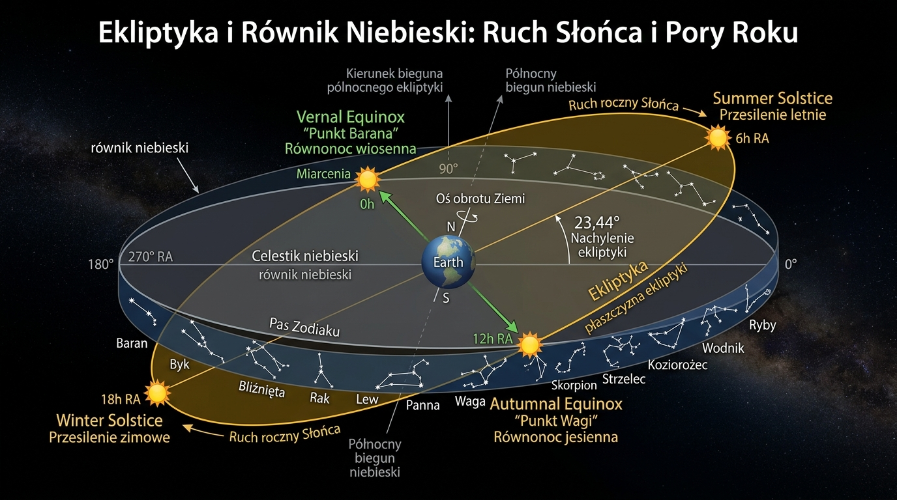

**Эклиптика (*ekliptyka*)** — ключевое понятие в сферической астрономии:

1. **Для земного наблюдателя**: Это кажущийся годовой путь Солнца по небесной сфере среди звёзд.
2. **Для космического наблюдателя**: Это плоскость орбиты обращения Земли вокруг Солнца (**плоскость эклиптики / *płaszczyzna ekliptyki***).

#### 4.1. Пересечение с небесным экватором и точки равноденствий

Плоскость эклиптики наклонена к плоскости **небесного экватора (*równik niebieski*)** под углом $\varepsilon \approx 23{,}44^\circ$ ($23^\circ 26'$), обусловленным наклоном оси вращения Земли.

Они пересекаются в двух диаметрально противоположных точках:

1. **Точка весеннего равноденствия (*punkt Barana*, $\Upsilon$)**:
   * Солнце пересекает небесный экватор, переходя из Южного полушария небесной сферы в Северное (около 20–21 марта).
   * В этот день на всей Земле день равен ночи ($12\text{ ч}$).
2. **Точка осеннего равноденствия (*punkt Wagi*, $\Omega$)**:
   * Солнце пересекает небесный экватор, переходя из Северного полушария в Южное (около 22–23 сентября).

#### 4.2. Точки солнцестояния (*Przesilenia*)

1. **Летнее солнцестояние (*przesilenie letnie*)**: Точка эклиптики с наибольшим склонением ($+23{,}44^\circ$, около 20–21 июня). В Северном полушарии — самый длинный день и самая короткая ночь.
2. **Зимнее солнцестояние (*przesilenie zimowe*)**: Точка эклиптики с наименьшим склонением ($-23{,}44^\circ$, около 21–22 декабря). В Северном полушарии — самый короткий день.

---

### 5. Rozpoznawanie gwiazdozbiorów — Поиск созвездий и Полярной звезды

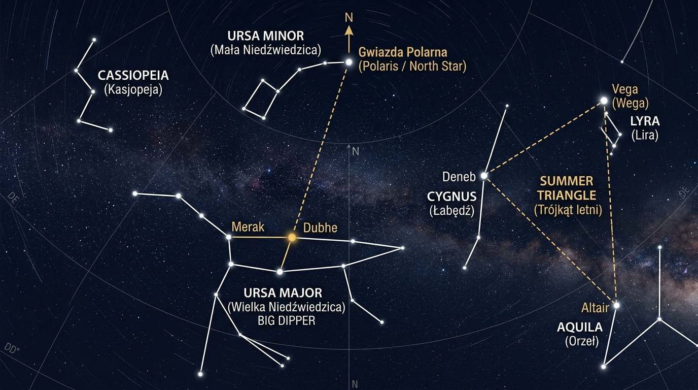

Ориентация по ночному небу — фундаментальный навык астронома:

1. **Поиск Полярной звезды (*Gwiazda Polarna / Polaris*)**:
   * Найти созвездие **Большой Медведицы (*Wielka Niedźwiedzica / Ursa Major*)**, в частности её яркую часть — Большой Ковш (*Wielki Wóz*).
   * Найти две крайние звезды стенки ковша: **Мерак (*Merak*)** и **Дубхе (*Dubhe*)**.
   * Мысленно провести луч от Мерака через Дубхе и отложить вдоль него расстояние, равное **5 отрезкам Merak–Dubhe**.
   * Луч точно укажет на **Полярную звезду (Polaris)** — ярчайшую звезду на конце хвоста **Малой Медведицы (*Mała Niedźwiedzica / Ursa Minor*)**.

2. **Главные незаходящие созвездия Северного полушария (*gwiazdozbiory okołobiegunowe*)**:
   * **Большая Медведица (*Ursa Major / Wielka Niedźwiedzica*)**;
   * **Малая Медведица (*Ursa Minor / Mała Niedźwiedzica*)**;
   * **Кассиопея (*Cassiopeia / Kasjopeja*)** — имеет характерную форму буквы **«W»** (или «M»).

3. **Летне-осенний треугольник (*Trójkąt letni*)**:
   * Состоит из трёх ярких звёзд разных созвездий:
     * **Вега (*Wega*)** в созвездии **Лиры (*Lira / Lyra*)**;
     * **Денеб (*Deneb*)** в созвездии **Лебедя (*Łabędź / Cygnus*)**;
     * **Альтаир (*Altair*)** в созвездии **Орла (*Orzeł / Aquila*)**.

---

### 6. Ruch jednostajny po okręgu — Равномерное движение по окружности

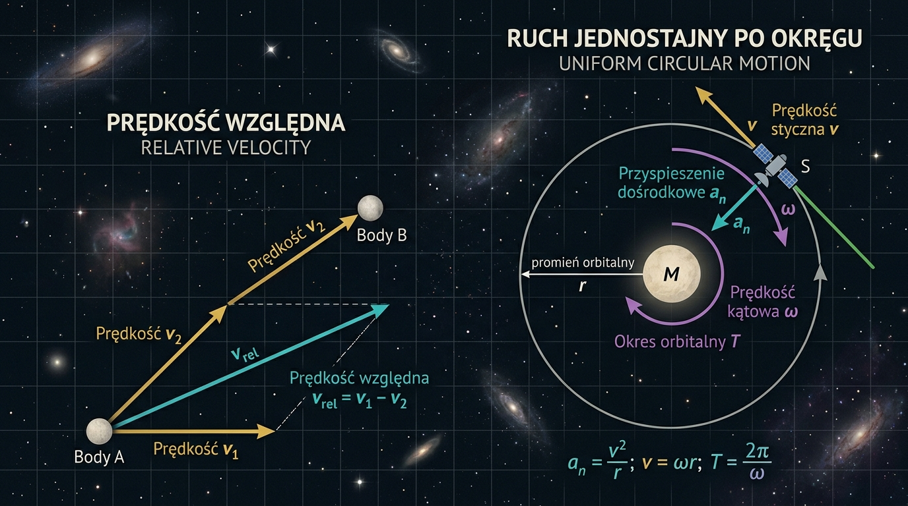

Многие орбитальные движения планет и спутников моделируются как **равномерное движение по окружности (*ruch jednostajny po okręgu*)**:

#### 6.1. Кинематические параметры

1. **Период обращения ($T$)**: Время одного полного оборота на $360^\circ$ ($2\pi\text{ рад}$) [секунды, $\text{с}$].
2. **Частота обращения ($f$)**: Число оборотов в единицу времени [Герцы, $\text{Гц} = 1/\text{с}$]:
   $$f = \frac{1}{T}$$
3. **Угловая скорость ($\omega$)**: Угол поворота в единицу времени [радианы в секунду, $\text{рад/с}$]:
   $$\omega = \frac{2\pi}{T} = 2\pi f$$
4. **Линейная (касательная) скорость ($v$)**: Модуль скорости движения по дуге окружности радиуса $r$ [метры в секунду, $\text{м/с}$]:
   $$v = \frac{2\pi r}{T} = \omega r$$
5. **Центростремительное ускорение ($a_n$)**: Ускорение, направленное к центру окружности и изменяющее направление вектора скорости:
   $$a_n = \frac{v^2}{r} = \omega^2 r = \frac{4\pi^2 r}{T^2}$$

---

### 7. Prędkość względna — Относительная скорость в астрономии

Вектор **относительной скорости (*prędkość względna*)** тела 1 относительно тела 2 равна векторной разности их скоростей относительно выбранной системы отсчёта (например, Солнца):

$$\mathbf{v}_{\text{rel}} = \mathbf{v}_1 - \mathbf{v}_2$$

#### 7.1. Частные случаи скалярного расчёта:

1. **Движение в одном направлении** (например, Земля и внешняя планета в противостоянии):
   $$v_{\text{rel}} = |v_1 - v_2|$$
2. **Движение в противоположных направлениях**:
   $$v_{\text{rel}} = v_1 + v_2$$
3. **Движение под углом $90^\circ$** (например, Земля и планета в квадратуре):
   $$v_{\text{rel}} = \sqrt{v_1^2 + v_2^2}$$

---

### 8. Orbity kołowe — Круговые орбиты (O)

Круговая орбита является частным случаем эллиптической орбиты с эксцентриситетом $e = 0$.

#### 8.1. Условие существования круговой орбиты
Движение спутника массой $m$ вокруг центрального тела массой $M \gg m$ по круговой орбите радиуса $r$ обеспечивается тем, что сила гравитационного притяжения выступает в роли центростремительной силы:

$$F_{\text{graw}} = F_{\text{dośrodkowa}} \quad \implies \quad G \frac{M m}{r^2} = \frac{m v^2}{r}$$

Отсюда круговая (первая космическая) скорость на расстоянии $r$:

$$\mathbf{v = \sqrt{\frac{G M}{r}}}$$

#### 8.2. Связь радиуса орбиты и периода
Подставляя $v = \frac{2\pi r}{T}$ в условие равновесия:

$$\frac{4\pi^2 r^2}{T^2} = \frac{G M}{r} \quad \implies \quad \mathbf{\frac{r^3}{T^2} = \frac{G M}{4\pi^2} = \text{const}}$$

Это формулировка **III закона Кеплера для круговых орбит**.

---

### 9. Геометрия орбит и параметров: Перигелий, Афелий, Эксцентриситет

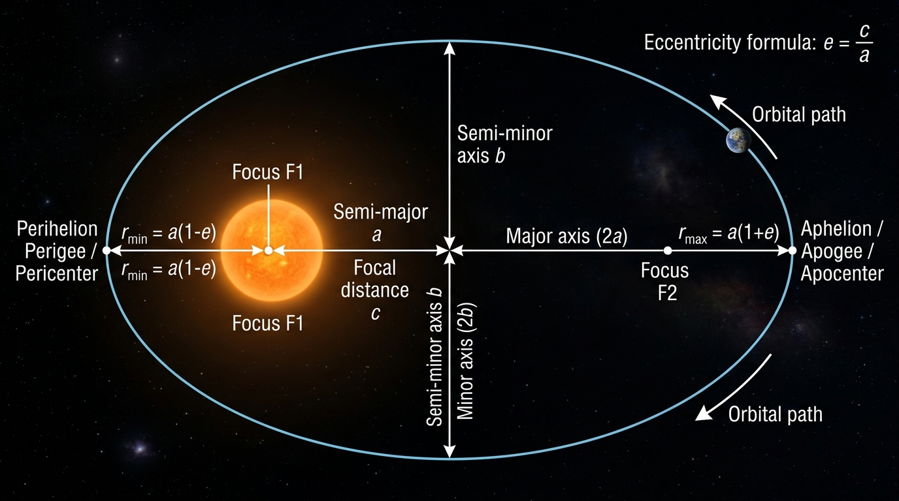

Точки наименьшего и наибольшего расстояния от фокуса называют **апсидами (*apsydy*)**:

1. **Перицентр (*perycentrum*)**: Точка орбиты, ближайшая к центральному гравитационному телу.
   * Для гелиоцентрической орбиты — **перигелий (*peryhelium*)**: точка минимального расстояния до Солнца:
     $$r_{\text{min}} = q = a(1-e)$$
   * Для геоцентрической орбиты — **перигей (*perygeum*)**: точка минимального расстояния до центра Земли:
     $$r_{\text{min}} = a(1-e)$$
2. **Апоцентр (*apocentrum*)**: Точка орбиты, наиболее удалённая от центрального гравитационного тела.
   * Для гелиоцентрической орбиты — **афелий (*aphelium*)**: точка максимального расстояния до Солнца:
     $$r_{\text{max}} = Q = a(1+e)$$
   * Для геоцентрической орбиты — **апогей (*apogeum*)**: точка максимального расстояния до центра Земли:
     $$r_{\text{max}} = a(1+e)$$
3. **Параметры эллиптической орбиты**:
   * $a$ — большая полуось эллипса (*półoś wielka*);
   * $b$ — малая полуось эллипса (*półoś mała*);
   * $c = \sqrt{a^2 - b^2}$ — фокальное расстояние (*odległość ogniskowa*);
   * $e$ — **эксцентриситет орбиты (*mimośród / ekscentryczność*)**:
     $$e = \frac{c}{a} = \sqrt{1 - \frac{b^2}{a^2}} = \frac{r_{\text{max}} - r_{\text{min}}}{r_{\text{max}} + r_{\text{min}}}$$

---

### 10. Элонгация (*Elongacja*) и конфигурации планет

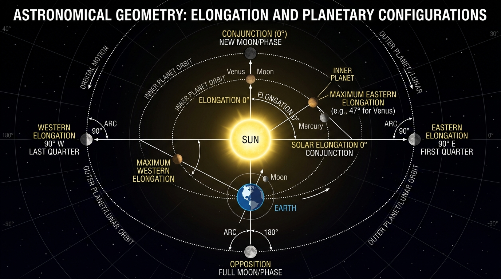

**Элонгация (*elongacja*)** — это угловое расстояние между Солнцем и планетным телом (или Луной), наблюдаемое с Земли.

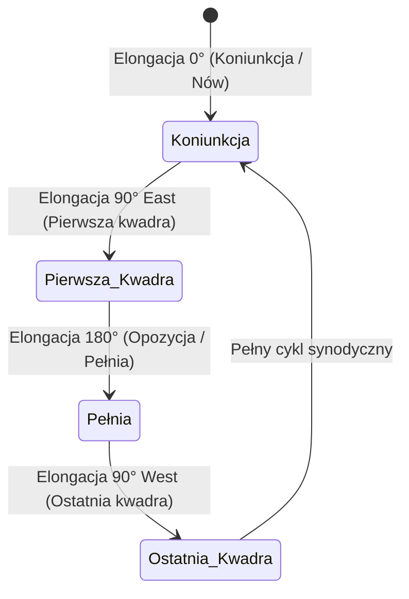

#### Характерные углы элонгации:

* **Соединение (*koniunkcja*) — элонгация $0^\circ$**: Светило находится на одной линии с Солнцем. В случае Луны — фаза **новолуние (*nów*)**.
* **Восточная элонгация $90^\circ\text{ E}$**: Светило находится на $90^\circ$ к востоку от Солнца. Видно вечером после заката. Для Луны — фаза **первая четверть (*pierwsza kwadra*)**.
* **Противостояние (*opozycja*) — элонгация $180^\circ$**: Светило находится на противоположной стороне неба от Солнца. Для Луны — фаза **полнолуние (*pełnia*)**. Видно всю ночь.
* **Западная элонгация $90^\circ\text{ W}$**: Светило находится на $90^\circ$ к западу от Солнца. Видно утром перед восходом. Для Луны — фаза **последняя четверть (*ostatnia kwadra*)**.
* **Максимальная элонгация внутренних планет (*maksymalna elongacja*)**: Внутренние планеты (Меркурий и Венера) не могут уходить на угол $180^\circ$. Их максимальный угловой уход ограничен орбитой:
  * Меркурий: $\psi_{\text{max}} \approx 18^\circ\text{--}28^\circ$
  * Венера: $\psi_{\text{max}} \approx 45^\circ\text{--}48^\circ$

---

### 11. Форма и радиусы Земли (*Promienie Ziemi*)

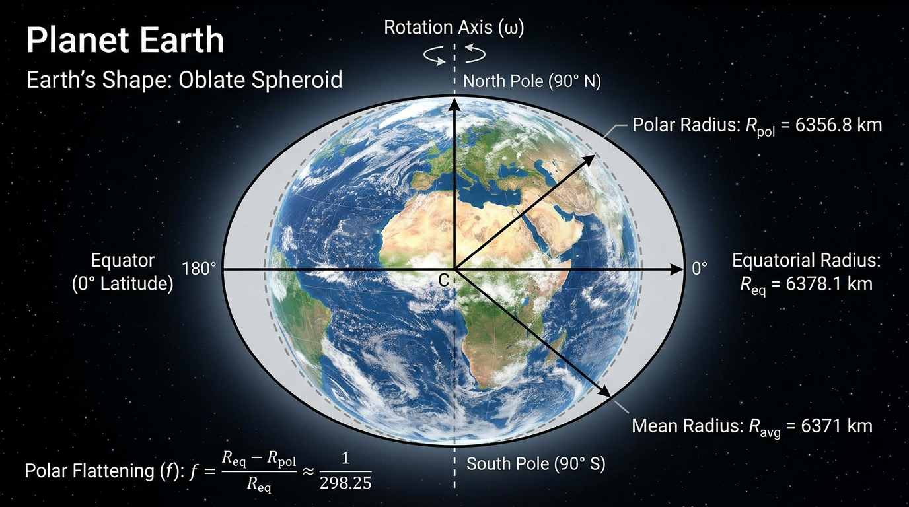

Из-за суточного вращения центробежная сила придает Земле форму **сплюснутого эллипсоида вращения (геоида)**:

1. **Экваториальный радиус (*promień równikowy*)**:
   $$R_{\text{eq}} \approx 6378{,}137\text{ км}$$
2. **Полярный радиус (*promień biegunowy*)**:
   $$R_{\text{pol}} \approx 6356{,}752\text{ км}$$
3. **Средний радиус Земли (*promień średni Ziemi*)**:
   $$R_\oplus = \sqrt[3]{R_{\text{eq}}^2 \cdot R_{\text{pol}}} \approx 6371{,}0008\text{ км} \approx 6371\text{ км}$$
4. **Полярное сжатие (*spłaszczenie biegunowe*)**:
   $$f = \frac{R_{\text{eq}} - R_{\text{pol}}}{R_{\text{eq}}} = \frac{6378{,}137 - 6356{,}752}{6378{,}137} \approx \frac{1}{298{,}257} \approx 0{,}003353$$

---

### 12. Расчёт суток в астрономии: Звёздные и Солнечные сутки (*Doba gwiazdowa a słoneczna*)

В астрономии строго различают два типа суток в зависимости от точки отсчёта:

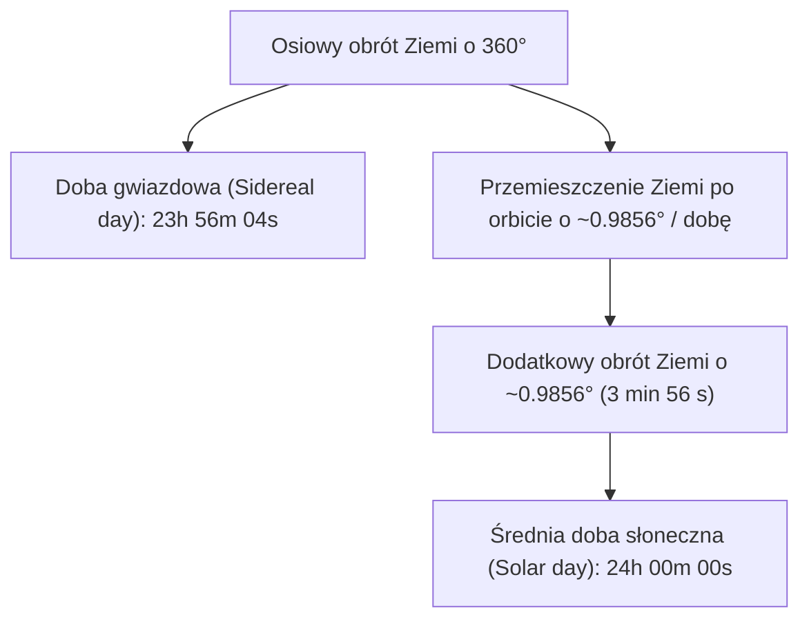

#### 12.1. Звёздные сутки (*Doba gwiazdowa*)
* **Точная продолжительность**:
  $$T_{\text{sid}} = 23^{\text{h}} 56^{\text{m}} 04{,}0905^{\text{s}} = 86164{,}0905\text{ секунд}$$

#### 12.2. Средние солнечные сутки (*Doba słoneczna*)
* **Точная продолжительность**:
  $$T_{\text{sol}} = 24^{\text{h}} 00^{\text{m}} 00^{\text{s}} = 86400\text{ секунд}$$

#### 12.3. Вывод разницы 3 мин 56 с
За одни сутки угловое смещение Земли по гелиоцентрической орбите составляет:

$$\Delta \theta = \frac{360^\circ}{365{,}2564} \approx 0{,}9856^\circ \approx 59' 08''$$

Время, необходимое Земле для поворота на $\Delta \theta = 0{,}9856^\circ$:

$$\Delta t = \frac{0{,}9856^\circ}{360^\circ} \times 86400\text{ с} \approx 236{,}55\text{ с} \approx 3\text{ мин } 56\text{ с}$$

---

### 13. Времена года и Высота Солнца над горизонтом (*Pory roku*) (O)

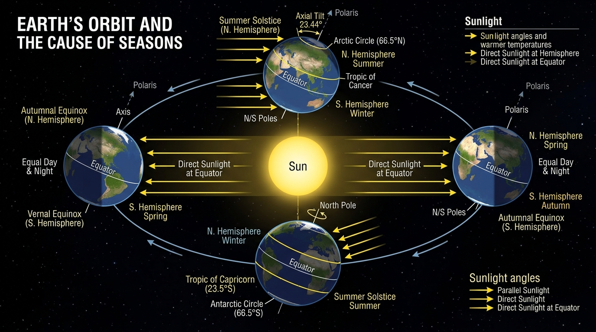

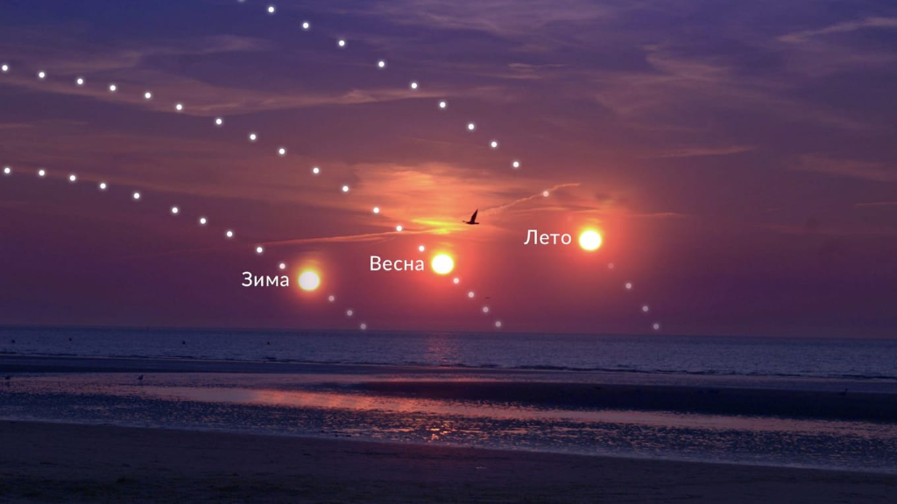

#### 13.1. Истинная причина смены времён года
Причина кроется в наклоне оси вращения Земли к нормали плоскости эклиптики на угол $\varepsilon \approx 23{,}44^\circ$.

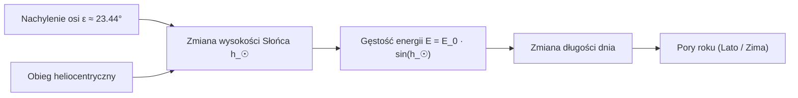

Поток лучистой энергии (*strumień promieniowania*):

$$E = E_0 \cdot \sin h_\odot$$

где $E_0 \approx 1361\text{ Вт/м}^2$ — солнечная постоянная, $h_\odot$ — угловая высота Солнца.

---

### 14. Луна, фазы и затмения — *Księżyc, Fazy i Zaćmienia* (O)

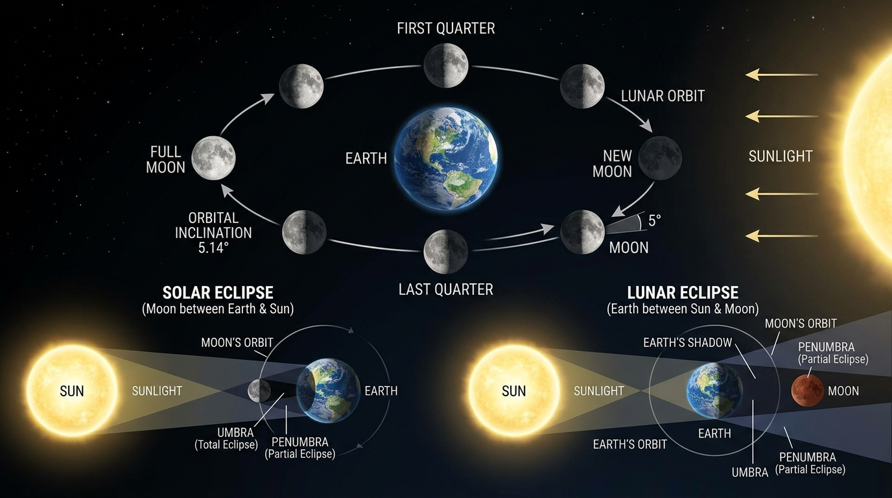

#### 14.1. Параметры Луны
* **Масса**: $M_{\text{Moon}} \approx 73\,420\,000\,000\,000\,000\,000\,000\text{ кг} \approx 7{,}342 \cdot 10^{22}\text{ кг} \approx \frac{1}{81,3} M_\oplus$
* **Радиус**: $R_{\text{Moon}} \approx 1737{,}1\text{ км} \approx 0{,}2727 R_\oplus$
* **Ускорение свободного падения**: $g_{\text{Moon}} \approx 1{,}62\text{ м/с}^2 \approx \frac{1}{6} g_\oplus$

#### 14.2. Месяц сидерический и синодический, Фазы Луны (O)
* **Сидерический месяц (*miesiąc gwiazdowy*)**: Период обращения относительно звёзд ($T_{\text{sid}} \approx 27{,}32\text{ сут}$).
* **Синодический месяц (*miesiąc synodyczny*)**: Период смены фаз от новолуния до новолуния ($S \approx 29{,}53\text{ сут}$):
  $$\frac{1}{S} = \frac{1}{T_{\text{sid}}} - \frac{1}{T_\oplus}$$

#### 14.3. Затмения Солнца и Луны — *Zaćmienie Słońca i Księżyca* (O)
1. **Солнечное затмение (*zaćmienie Słońca*)**: Происходит в фазе **новолуния (*nów*)**, когда Луна проходит между Землёй и Солнцем. Подразделяются на полное (*całkowite*), частичное (*częściowe*) и кольцеобразное (*obrączkowe*).
2. **Лунное затмение (*zaćmienie Księżyca*)**: Происходит в фазе **полнолуния (*pełnia*)**, когда Луна попадает в конус тени (*cień*) или полутени (*półcień*) Земли.
3. **Условие затмений**: Затмения происходят только тогда, когда Луна находится вблизи **лунных узлов (*węzły Księżyca*)** — точек пересечения орбиты Луны (наклон $i \approx 5{,}14^\circ$) с эклиптикой.

---

### 15. Астрономическая шкала расстояний — *Astronomiczne jednostki odległości*

В астрономии применяются специальные единицы измерения больших расстояний:

1. **Астрономическая единица (*jednostka astronomiczna, au*)**:
   Фиксированное значение (IAU 2012):
   $$\mathbf{1\text{ au} = 149\,597\,870\,700\text{ м} \approx 149{,}6\text{ млн км} \approx 1{,}496 \cdot 10^{11}\text{ м}}$$
2. **Световой год (*rok świetlny, ly*)**:
   Расстояние, проходимое светом в вакууме ($c = 299\,792\,458\text{ м/с}$) за один юлианский год ($365{,}25\text{ суток} = 31\,557\,600\text{ с}$):
   $$\mathbf{1\text{ ly} = c \cdot t = 9\,460\,730\,472\,580\,800\text{ м} \approx 9{,}46 \cdot 10^{15}\text{ м} \approx 63\,241\text{ au}}$$
3. **Парсек (*parsek, pc*)**:
   Расстояние, с которого средний радиус земной орбиты ($1\text{ au}$) виден под углом годичного параллакса $\pi = 1''$ (одна угловая секунда):
   $$\mathbf{1\text{ pc} = \frac{1\text{ au}}{\tan 1''} \approx 3{,}0856776 \cdot 10^{16}\text{ м} \approx 3{,}2616\text{ ly} \approx 206\,265\text{ au}}$$

---

### 16. Математический аппарат, физика и геометрический инструментарий

В данном разделе собраны фундаментальные законы и формулы с описанием каждой переменной и единиц измерения СИ (SI):

#### 16.1. Закон всемирного тяготения Ньютона (*Prawo powszechnego ciążenia*)

$$F = G \frac{M m}{r^2}$$

* $F$ — сила гравитации [Ньютоны, $\text{Н}$].
* $G = 6{,}67430 \cdot 10^{-11}\text{ Н}\cdot\text{м}^2/\text{кг}^2$ — гравитационная постоянная.
* $M, m$ — массы взаимодействующих тел [килограммы, $\text{кг}$].
* $r$ — расстояние между центрами масс [метры, $\text{м}$].

#### 16.2. Ускорение свободного падения и Свободное падение cиал

$$g = \frac{G M}{R^2}$$

Формулы свободного падения тела без начальной скорости ($v_0 = 0$):
* Скорость в момент времени $t$: $v = g t$
* Пройденный путь (высота): $h = \frac{1}{2} g t^2$
* Связь скорости и высоты: $v = \sqrt{2 g h}$

#### 16.3. Первая и Вторая космические скорости

* **Первая космическая скорость ($v_{\text{I}}$)**:
  $$v_{\text{I}} = \sqrt{\frac{G M}{R}} = \sqrt{g R} \quad (v_{\text{I, Ziemia}} \approx 7{,}91\text{ км/с})$$
* **Вторая космическая скорость ($v_{\text{II}}$)**:
  $$v_{\text{II}} = \sqrt{\frac{2 G M}{R}} = \sqrt{2} \cdot v_{\text{I}} \quad (v_{\text{II, Ziemia}} \approx 11{,}19\text{ км/с})$$

#### 16.4. III закон Кеплера (*III prawo Keplera*)

$$\frac{T_1^2}{T_2^2} = \frac{a_1^3}{a_2^3} \quad \Longleftrightarrow \quad T^2 = a^3 \quad (\text{при } a \text{ в [au] и } T \text{ в земных годах})$$

#### 16.5. Закон инсоляции

$$E = E_0 \cdot \sin h_\odot$$

#### 16.6. Относительное движение и синодический период

$$\frac{1}{S} = \left| \frac{1}{T_1} - \frac{1}{T_2} \right|$$

#### 16.7. Notacja wykładnicza i jednostki SI — Научная нотация и СИ

1. **Экспоненциальная нотация (*notacja wykładnicza*)**: Запись числа в виде $A \cdot 10^n$, где $1 \le |A| < 10$, $n \in \mathbb{Z}$.
2. **Основные десятичные приставки SI**:
   * Тера ($\text{T}$) = $10^{12}$, Гига ($\text{G}$) = $10^9$, Мега ($\text{M}$) = $10^6$, Кило ($\text{k}$) = $10^3$.
   * Милли ($\text{m}$) = $10^{-3}$, Микро ($\mu$) = $10^{-6}$, Нано ($\text{n}$) = $10^{-9}$.

#### 16.8. Obliczanie długości okręgu i pola koła — Геометрия круга и сферы

1. **Длина окружности (*długość okręgu*)**:
   $$L = 2\pi r = \pi d$$
2. **Площадь круга (*pole koła*)**:
   $$S = \pi r^2 = \frac{\pi d^2}{4}$$
3. **Площадь поверхности сферы (*pole powierzchni kuli*)**:
   $$A = 4\pi R^2$$
4. **Объём шара (*objętość kuli*)**:
   $$V = \frac{4}{3}\pi R^3$$

---

### 17. Задачи для самостоятельного решения (*Zadania do samodzielnego rozwiązania*)

> *(Примечание: Все подробные решения и ответы вынесены в специальный итоговый **Раздел 20** в конце учебника. Сначала попробуйте решить задачи самостоятельно!)*

#### Задача 1. Расчёт ускорения свободного падения на поверхности Земли
Вычислить теоретическое ускорение свободного падения $g_\oplus$ на поверхности Земли, приняв $M_\oplus = 5\,972\,200\,000\,000\,000\,000\,000\,000\text{ кг}$, средний радиус $R_\oplus = 6371\text{ км}$ и $G = 6{,}67430 \cdot 10^{-11}\text{ Н}\cdot\text{м}^2/\text{кг}^2$.

#### Задача 2. Линейная скорость геостационарного спутника
Искусственный спутник Земли (*sztuczny satelita Ziemi*) движется по круговой орбите на геоцентрическом расстоянии $r = 42\,000\text{ км}$ от центра планеты. Найти его линейную скорость $v$.

#### Задача 3. Применение III закона Кеплера для астероида
Астероид Главного пояса движется вокруг Солнца по круговой орбите с большой полуосью $a = 4\text{ au}$. Определить период обращения астероида $T$ в земных годах.

#### Задача 4. Время падения тела с высоты
Камень падает без начальной скорости с обрыва высотой $h = 19{,}6\text{ м}$ на поверхности Земли ($g = 9{,}8\text{ м/с}^2$). Определить время падения $t$ и конечную скорость $v$.

#### Задача 5. Длина орбиты Земли
Принимая орбиту Земли вокруг Солнца за круговую радиуса $r = 1\text{ au} = 1{,}496 \cdot 10^{11}\text{ м}$, вычислить длину орбиты $L$ и среднюю орбитальную скорость Земли $v_\oplus$ в км/с.

---

### 18. Контрольные вопросы для самопроверки (*Pytania kontrolne*)

> *(Примечание: Ответы на все вопросы приведены в **Разделе 20** в конце учебника.)*

#### Базовый уровень
1. Что такое планета (*planeta*) и чем она фундаментально отличается от естественного спутника (*naturalny satelita*)?
2. Какова масса Солнца в килограммах точным числом без использования степеней 10?
3. Что такое астрономическая единица (*au*), световой год (*ly*) и парсек (*pc*)?
4. Как с помощью созвездия Большой Медведицы найти Полярную звезду (*Gwiazda Polarna*)?
5. Что такое эклиптика (*ekliptyka*) и под каким углом она наклонена к небесному экватору?
6. Назовите географический и астрономический смысл Тропика Рака (*Zwrotnik Raka*) и Северного полярного круга (*Północne koło podbiegunowe*).

#### Средний уровень
7. Почему высота Северного полюса мира $h_P$ равна географической широте места наблюдения $\varphi$?
8. Почему солнечные сутки (*doba słoneczna*) длиннее звёздных суток (*doba gwiazdowa*) ровно на 3 минуты 56 секунд? Выведите этот интервал математически.
9. В чём состоит отличие между термином «перигелий» (*peryhelium*) как точкой орбиты и «перигелийным расстоянием» ($r_{\text{min}} = q = a(1-e)$)?
10. Что такое элонгация (*elongacja*) и почему максимальная элонгация Венеры не может превышать $48^\circ$?
11. Каковы типы солнечных и лунных затмений и при каких условиях они возникают?

---

### 19. Список литературы и источников (*Zalecana literatura*)

Настоящий учебный материал составлен в полном соответствии с рекомендациями **Olimpiada Astronomiczna Juniorów**:

1. **J.M. Kreiner**, *Ziemia i Wszechświat – astronomia nie tylko dla geografów*.
2. **K. Rudnicki**, *Astronomia*.
3. **H. Chrupała, J. Kreiner, M. Szczepański**, *Zadania z astronomii z rozwiązaniami*.
4. **T. Jarzębowski**, *Elementy Astronomii*.
5. **W. Mizerski**, *Tablice fizyczno-astronomiczne*.
6. **A. Branicki**, *W stronę nieba – Interaktywna szkoła astronomii*.
7. Порталы: *Astronarium*, *AstroNET*, *Urania — Postępy Astronomii*.

---

### 20. Раздел решений задач и ответов (*Rozwiązania zadań i Odpowiedzi*)

#### 20.1. Подробные решения задач из Раздела 17

* **Решение Задачи 1 (Расчёт $g_\oplus$)**:
  1. $R_\oplus = 6371\text{ км} = 6{,}371 \cdot 10^6\text{ м}$.
  2. $g = \frac{G M_\oplus}{R_\oplus^2} = \frac{6{,}67430 \cdot 10^{-11} \cdot 5{,}9722 \cdot 10^{24}}{(6{,}371 \cdot 10^6)^2} \approx 9{,}819\text{ м/с}^2$.
  * **Ответ**: $\mathbf{g_\oplus \approx 9{,}81\text{ м/с}^2}$.

* **Решение Задачи 2 (Скорость спутника $v$)**:
  1. $r = 42\,000\text{ км} = 4{,}2 \cdot 10^7\text{ м}$.
  2. $v = \sqrt{\frac{G M_\oplus}{r}} = \sqrt{\frac{6{,}67430 \cdot 10^{-11} \cdot 5{,}9722 \cdot 10^{24}}{4{,}2 \cdot 10^7}} \approx 3080{,}6\text{ м/с} \approx 3{,}08\text{ км/с}$.
  * **Ответ**: $\mathbf{v \approx 3{,}08\text{ км/с}}$.

* **Решение Задачи 3 (III закон Кеплера)**:
  1. $T^2 = a^3 \implies T^2 = 4^3 = 64 \implies T = 8\text{ лет}$.
  * **Ответ**: $\mathbf{T = 8\text{ лет}}$.

* **Решение Задачи 4 (Свободное падение)**:
  1. $t = \sqrt{\frac{2h}{g}} = \sqrt{\frac{2 \cdot 19{,}6}{9{,}8}} = \sqrt{4} = 2\text{ с}$.
  2. $v = g t = 9{,}8 \cdot 2 = 19{,}6\text{ м/с}$.
  * **Ответ**: $\mathbf{t = 2\text{ с}, v = 19{,}6\text{ м/с}}$.

* **Решение Задачи 5 (Длина орбиты и скорость Земли)**:
  1. $L = 2\pi r = 2 \cdot 3{,}14159 \cdot 1{,}496 \cdot 10^{11} \approx 9{,}40 \cdot 10^{11}\text{ м} \approx 940\text{ млн км}$.
  2. $v = \frac{L}{T} = \frac{9{,}40 \cdot 10^{11}\text{ м}}{31\,558\,150\text{ с}} \approx 29\,780\text{ м/с} \approx 29{,}8\text{ км/с}$.
  * **Ответ**: $\mathbf{L \approx 940\text{ млн км}, v_\oplus \approx 29{,}8\text{ км/с}}$.

---

#### 20.2. Ответы на контрольные вопросы из Раздела 18

1. **Планета vs Спутник**: Планета вращается напрямую вокруг звезды и расчистила свою орбиту; естественный спутник вращается вокруг планеты.
2. **Масса Солнца**: $1\,988\,500\,000\,000\,000\,000\,000\,000\,000\,000\text{ кг}$.
3. **Единицы расстояния**: $1\text{ au} = 149\,597\,870\,700\text{ м}$; $1\text{ ly} \approx 9{,}46 \cdot 10^{15}\text{ м}$; $1\text{ pc} \approx 3{,}2616\text{ ly} \approx 3{,}086 \cdot 10^{16}\text{ м}$.
4. **Поиск Полярной звезды**: Провести луч через звезды Мерак и Дубхе в Большой Медведице и отложить 5 их отрезков до Polaris в Малой Медведице.
5. **Эклиптика**: Видимый путь Солнца по небесной сфере (плоскость земной орбиты). Наклонена под углом $\varepsilon \approx 23{,}44^\circ$.
6. **Тропик Рака и Полярный круг**: Тропик Рака ($23{,}44^\circ\text{ N}$) — широта зенита Солнца в летнее солнцестояние; Полярный круг ($66{,}56^\circ\text{ N}$) — граница полярного дня и ночи.
7. **Высота полюса мира $h_P = \varphi$**: Угол наклона оси мира к горизонту математически равен географической широте наблюдателя.
8. **Вывод разницы суток**: За солнечные сутки Земля смещается по орбите на $\Delta \theta = \frac{360^\circ}{365{,}2564} \approx 0{,}9856^\circ$. Время доворота Земли: $\Delta t = \frac{0{,}9856^\circ}{360^\circ} \times 86400\text{ с} \approx 3\text{ мин } 56\text{ с}$.
9. **Перигелий vs Расстояние**: Перигелий — точка орбиты; перигелийное расстояние — минимальная дистанция $r_{\text{min}} = q = a(1-e)$.
10. **Элонгация Венеры**: Угловое расстояние от Солнца, ограниченное орбитой Венеры ($\sin \psi_{\text{max}} = \frac{a_{\text{Ven}}}{a_\oplus} \implies \psi_{\text{max}} \approx 46^\circ\text{--}48^\circ$).
11. **Затмения**: Солнечное в новолуние, лунное в полнолуние, при условии совпадения с лунными узлами.
