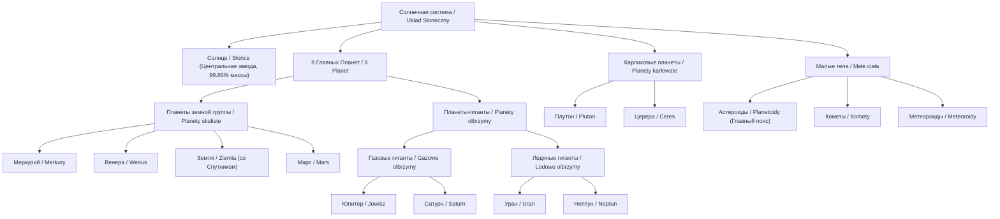
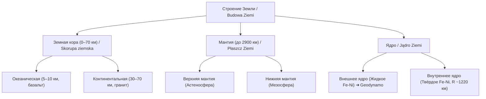
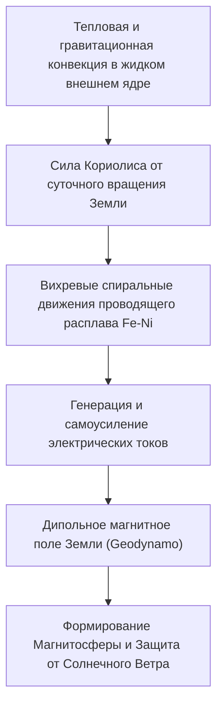
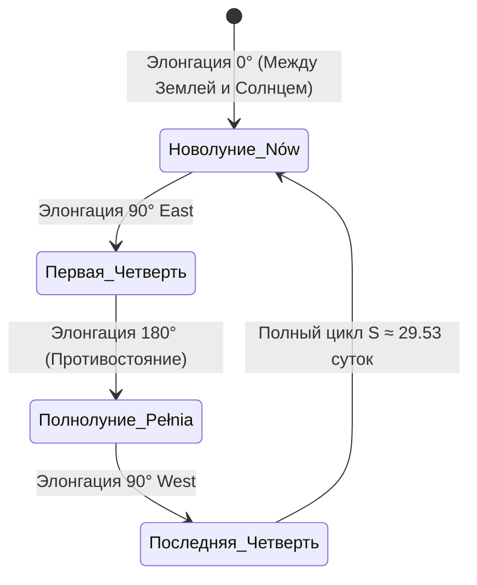

# Учебник по астрономии. Тема 1

## Единство мира. Природа Солнечной системы (*Układ Słoneczny*). Земля (*Ziemia*) — планета. Луна (*Księżyc*) — естественный спутник (*naturalny satelita*)

---


---

### 1. Что нужно понять после изучения темы

После освоения материала вы будете уверенно:

* **Объяснять**, почему Земля — это планета (*planeta*), а Луна — естественный спутник (*naturalny satelita*).
* **Знать** порядок планет от Солнца и их деление на планеты земной группы (*planety skaliste / typu ziemskiego*) и планеты-гиганты (*gazowe olbrzymy / lodowe olbrzymy*).
* **Различать** осевое вращение (*obrót wokół własnej osi*) и орбитальное обращение (*obieg wokół Słońca*).
* **Понимать** механику смены дня и ночи (*dzień i noc*), а также истинную астрономическую причину смены времён года (*pory roku*).
* **Знать** внутреннее строение Земли, физический механизм геодинамо (*geodynamo*) и функцию магнитосферы (*magnetosfera*).
* **Объяснять** смену фаз Луны (*fazy Księżyca*), геометрию солнечных и лунных затмений (*zaćmienie Słońca / Księżyca*), а также возникновение морских приливов и отливов (*przypływ / odpływ*).
* **Применять** фундаментальные законы тяготения Ньютона и III закон Кеплера (*prawa Keplera*) для количественных расчётов орбитальных скоростей и периодов обращения.

---

### 2. Солнечная система — *Układ Słoneczny*

**Солнечная система (*Układ Słoneczny*)** — это гравитационно связанная планетная система (*układ planetarny*), состоящая из центральной звезды — Солнца (*Słońce*) — и всех обращающихся вокруг него небесных тел:

* **Солнце (*Słońce*)** — центральное массивное тело системы, сосредоточившее $99{,}86\%$ всей массы Солнечной системы.
* **8 планет (*8 planet*)** — классические планеты, движущиеся по эллиптическим орбитам, близким к круговым.
* **Естественные спутники планет (*naturalne satelity planet*)** — небесные тела, обращающиеся вокруг планет (более 200 известных спутников).
* **Карликовые планеты (*planety karłowate*)** — объекты гидростатического равновесия, не расчистившие свою орбиту (например, Плутон — *Pluton*, Церера — *Ceres*, Эрида — *Eris*).
* **Астероиды (*planetoidy / asteroidy*)** — каменистые малые тела, сосредоточенные преимущественно в Главном поясе астероидов (*pas planetoid*) между Марсом и Юпитером ($2{,}1\text{--}3{,}3\text{ au}$).
* **Кометы (*komety*)** — ледяные малые тела из пояса Койпера (*pas Kuipera*) и облака Оорта (*obłok Oorta*).
* **Метеороиды (*meteoroidy*)**, метеоры (*meteory*) и метеориты (*meteoryty*).
* **Межпланетное вещество (*materia międzyplanetarna*)** и солнечный ветер (*wiatr słoneczny*).



#### Классификация планет:

1. **Планеты земной группы (*planety skaliste / planety typu ziemskiego*)**:
   * **Состав**: Меркурий (*Merkury*), Венера (*Wenus*), Земля (*Ziemia*), Марс (*Mars*).
   * **Характеристики**: Твёрдая силикатная кора и мантия, металлическое (железо-никелевое) ядро, относительно небольшие размеры, отсутствие колец и малое количество спутников (у Земли — 1, у Марса — 2, у Меркурия и Венеры — 0).
   * **Плотность**: Высокая средняя плотность $\rho \approx 3{,}9\text{--}5{,}5\text{ г/см}^3$.

2. **Планеты-гиганты (*planety olbrzymy*)**:
   * **Газовые гиганты (*gazowe olbrzymy*)**: Юпитер (*Jowisz*), Сатурн (*Saturn*). Состоят преимущественно из водорода и гелия ($\rho \approx 0{,}7\text{--}1{,}3\text{ г/см}^3$).
   * **Ледяные гиганты (*lodowe olbrzymy*)**: Уран (*Uran*), Нептун (*Neptun*). Содержат значительную долю тяжелых льдов ($H_2O, NH_3, CH_4$).
   * **Характеристики**: Колоссальные массы и размеры, отсутствие твёрдой поверхности, мощная динамичная атмосфера, дифференциальное вращение, развитые системы колец и многочисленные спутники.

> [!NOTE]
> **Плутон (*Pluton*)**: В 2006 году XXIVI Генеральная ассамблея Международного астрономического союза (МАС / IAU) приняла новое официальное определение планеты. Поскольку Плутон не сумел гравитационно расчистить окрестности своей орбиты от множества других объектов пояса Койпера, он был переведён в категорию **карликовых планет (*planety karłowate*)**.

---

### 3. Основные астрономические термины (*Pojęcia astronomiczne*)

| Русский термин | Термин по-польски | Астрофизическое определение |
| :--- | :--- | :--- |
| **Солнце** | *Słońce* | Звезда (*gwiazda*) спектрального класса G2V, гравитационный и энергетический центр системы. |
| **Земля** | *Ziemia* | Третья планета от Солнца, крупнейшая из планет земной группы. |
| **Луна** | *Księżyc* | Единственный естественный спутник Земли, находящийся в приливном захвате. |
| **Солнечная система** | *Układ Słoneczny* | Солнце и комплекс гравитационно связанных с ним небесных тел. |
| **Планета** | *planeta* | Небесное тело, обращающееся вокруг звезды, находящееся в гидростатическом равновесии и расчистившее свою орбиту. |
| **Каменистая планета** | *planeta skalista* | Планета с твёрдой силикатной корой и металлическим ядром. |
| **Естественный спутник** | *naturalny satelita* | Вторичное небесное тело, обращающееся вокруг планеты по замкнутой траектории. |
| **Орбита** | *orbita* | Траектория движения космического тела в гравитационном поле центрального объекта. |
| **Вращение** | *obrót* | Механическое вращательное движение тела вокруг собственной внутренней оси (*oś obrotu*). |
| **Обращение** | *obieg* | Орбитальное движение одного тела вокруг другого центрального тела или общего центра масс. |
| **Ось вращения** | *oś obrotu* | Воображаемая прямая, относительно которой происходит суточное вращение планеты. |
| **Плоскость эклиптики** | *płaszczyzna ekliptyki* | Плоскость орбиты обращения Земли вокруг Солнца. |
| **Наклон оси вращения** | *nachylenie osi obrotu* | Угол наклона оси вращения к перпендикуляру плоскости орбиты (для Земли $\varepsilon \approx 23{,}44^\circ$). |
| **Перигелий** | *peryhelium* | Ближайшая к Солнцу точка гелиоцентрической орбиты ($r_{\text{min}} = a(1-e)$). |
| **Афелий** | *aphelium* | Наиболее удалённая от Солнца точка гелиоцентрической орбиты ($r_{\text{max}} = a(1+e)$). |
| **Перигей** | *perygeum* | Ближайшая к центру Земли точка околоземной орбиты Луны или ИСЗ. |
| **Апогей** | *apogeum* | Наиболее удалённая от центра Земли точка околоземной орбиты. |
| **Перицентр / Апоцентр** | *perycentrum / apocentrum* | Обобщённые наименования ближайшей и дальней точек орбиты относительно центрального тела. |
| **Эксцентриситет орбиты** | *mimośród / ekscentryczność* | Безразмерный параметр формы эллипса ($0 \le e < 1$). Для Земли $e \approx 0{,}0167$. |
| **Прилив и отлив** | *przypływ i odpływ* | Периодические колебания уровня моря, вызванные градиентом гравитации Луны и Солнца. |
| **Солнечное затмение** | *zaćmienie Słońca* | Явление, при котором диск Луны перекрывает Солнце для земного наблюдателя. |
| **Лунное затмение** | *zaćmienie Księżyca* | Погружение Луны в конус тени, отбрасываемый Землёй. |
| **Новолуние** | *nów* | Фаза, когда Луна находится между Землёй и Солнцем (элонгация $0^\circ$). |
| **Первая четверть** | *pierwsza kwadra* | Фаза, при которой освещена правая половина видимого диска Луны (элонгация $90^\circ$ E). |
| **Полнолуние** | *pełnia* | Фаза, когда всё видимое с Земли полушарие Луны освещено (элонгация $180^\circ$). |
| **Последняя четверть** | *ostatnia kwadra* | Фаза, при которой освещена левая половина видимого диска Луны (элонгация $90^\circ$ W). |
| **Астрономическая единица** | *jednostka astronomiczna (au)* | Мера расстояния в астрономии: $1\text{ au} = 149\,597\,870\,700\text{ м} \approx 149{,}6\text{ млн км}$. |
| **Солнечный ветер** | *wiatr słoneczny* | Поток высокоэнергетических протонов, электронов и $\alpha$-частиц из солнечной короны. |
| **Полярное сияние** | *zorza polarna* | Свечение верхних слоёв атмосферы при вторжении заряженных частиц солнечного ветра. |

---

### 4. Земля — *Ziemia*

#### 4.1. Основные физические параметры

* **Масса Земли (*masa Ziemi*)**: $M_\oplus \approx 5{,}9722 \cdot 10^{24}\text{ кг}$
* **Средний радиус (*promień średni Ziemi*)**: $R_\oplus \approx 6371\text{ км} = 6{,}371 \cdot 10^6\text{ м}$
* **Экваториальный радиус**: $R_{\text{eq}} \approx 6378{,}1\text{ км}$
* **Полярный радиус**: $R_{\text{pol}} \approx 6356{,}8\text{ км}$ (сжатие Земли $f = \frac{R_{\text{eq}}-R_{\text{pol}}}{R_{\text{eq}}} \approx \frac{1}{298{,}25}$)
* **Средняя плотность (*średnia gęstość*)**: $\rho_\oplus \approx 5{,}515\text{ г/см}^3 = 5515\text{ кг/м}^3$ (самая высокая среди всех планет Солнечной системы)
* **Астрономическая единица (*jednostka astronomiczna*)**: $1\text{ au} \approx 1{,}496 \cdot 10^{11}\text{ м}$
* **Средняя орбитальная скорость (*prędkość orbitalna*)**: $v_{\text{orb}} \approx 29{,}78\text{ км/с} \approx 30\text{ км/с}$

---

### 5. Почему Земля не падает на Солнце?

Между Солнцем и Землей действует сила всемирного тяготения (*siła grawitacji*):

$$F = G \frac{M_\odot M_\oplus}{r^2}$$

Если бы Земля покоилась относительно Солнца ($v = 0$), она за время $\tau = \frac{\pi}{2^{3/2}} \sqrt{\frac{r^3}{G M_\odot}} \approx 64{,}5\text{ суток}$ по прямой упала бы в раскалённые недра звезды.

Однако Земля обладает высокой тангенциальной орбитальной скоростью $v \approx 29{,}8\text{ км/с}$. За счёт непрерывного центростремительного ускорения $a_n = \frac{v^2}{r}$, сообщаемого солнечной гравитацией, траектория Земли постоянно изгибается. 

$$a_n = \frac{G M_\odot}{r^2} = \frac{v^2}{r} \implies v = \sqrt{\frac{G M_\odot}{r}}$$

Земля непрерывно «падает» на Солнце, но из-за поперечного смещения непрерывно промахивается. Траектория искривляется в замкнутую эллиптическую кривую — **орбиту (*orbita*)**.

> [!IMPORTANT]
> **Вывод**: Орбитальное движение (*ruch orbitalny*) — это не состояние невесомости от «отсутствия гравитации», а состояние непрерывного свободного падения под действием силы тяжести при наличии достаточной поперечной (тангенциальной) скорости.

---

### 6. Вращение и обращение (*Obrót a obieg*)

Принципиальное кинематическое различие:

* **Осевое вращение (*obrót wokół własnej osi*)**:
  * Вращение тела вокруг собственной полярной оси.
  * Период относительно далёких звёзд — **звёздные сутки (*doba gwiazdowa*)**: $T_{\text{sid}} \approx 23\text{ ч } 56\text{ мин } 4{,}09\text{ с}$.
  * Период относительно Солнца — **средние солнечные сутки (*doba słoneczna*)**: $T_{\text{sol}} = 24\text{ часа}$.
  * *Следствие*: смена дня и ночи (*dzień i noc*), кажущееся суточное вращение небесной сферы (*sfera niebieska*).

* **Орбитальное обращение (*obieg wokół Słońca*)**:
  * Поступательное движение по гелиоцентрической орбите.
  * Период — **звёздный (сидерический) год (*rok gwiazdowy*)**: $T \approx 365{,}2564\text{ суток}$.
  * *Следствие*: годовое перемещение Солнца по эклиптике на фоне созвездий зодиака (приблизительно $1^\circ$ в сутки).

$$\text{Вращение (*obrót*)} \longrightarrow \text{день и ночь (*dzień i noc*)}$$
$$\text{Обращение (*obieg*)} + \text{наклон оси (*nachylenie osi*)} \longrightarrow \text{времена года (*pory roku*)}$$

---

### 7. Видимое суточное движение светил

Земля вращается вокруг оси **с запада на восток (*z zachodu na wschód*)** (против часовой стрелки при наблюдении с Северного полюса мира).

По закону относительности движения наблюдателю кажется, что небесная сфера вместе с Солнцем, Луной и звёздами совершает плавное вращение в обратную сторону: **с востока на запад (*ze wschodu na zachód*)**. 
* Солнце восходит над восточным горизонтом;
* Кульминирует в полдень на юге (для наблюдателей в Северном полушарии);
* Заходит за горизонт на западе.

---

### 8. Времена года (*Pory roku*)


* ❌ **Ошибочное мнение**: «Летом жарко, потому что Земля находится ближе к Солнцу».
* ✅ **Астрономический факт**: В начале января (около 3 января), когда в Северном полушарии зима, Земля проходит **перигелий (*peryhelium*)** и находится на минимальном расстоянии от Солнца ($r_{\text{min}} \approx 147{,}1\text{ млн км}$). В начале июля (около 4 июля) Земля проходит **афелий (*aphelium*)** ($r_{\text{max}} \approx 152{,}1\text{ млн км}$). Разница расстояний составляет всего около $3,4\%$, что оказывает минимальное влияние на климатический сезон.
* ✅ **Истинная причина**: Наклон оси вращения Земли к перпендикуляру к плоскости эклиптики на угол $\varepsilon \approx 23{,}44^\circ$ ($23^\circ 26'$).

Ось сохраняет свою ориентацию в пространстве постоянной (направлена на Полярную звезду). Когда к Солнцу наклонено Северное полушарие:

1. Полуденная высота Солнца над горизонтом (*wysokość Słońca*) значительно больше.
2. Солнечные лучи падают более отвесно, перенося максимум энергии на малую площадь поверхности.
3. Световой день длится значительно дольше ночи, прогревая атмосферу и почву. В Северном полушарии наступает **лето (*lato*)**, а в Южном в этот же период — **зима (*zima*)**. Through 6 months, the geometry changes symmetrically.

---

### 9. Высота Солнца над горизонтом (*Wysokość Słońca*)

Поток лучистой энергии (*strumień promieniowania*), падающий на единичную горизонтальную площадку, пропорционален синусу высоты светила над горизонтом:

$$E = E_0 \cdot \sin h_\odot$$

где $E_0$ — солнечная постоянная ($E_0 \approx 1361\text{ Вт/м}^2$), $h_\odot$ — угловая высота Солнца над горизонтом.

```mermaid
flowchart LR
    Tilt["Наклон оси ε ≈ 23.44°"] + Orbit["Орбитальное обращение"] --> Insolation["Изменение полуденной высоты h_☉"]
    Insolation --> Energy["Плотность энергии E = E_0 · sin(h_☉)"]
    Energy --> DayLength["Изменение длительности светового дня"]
    DayLength --> Seasons["Смена времён года (Лето / Зима)"]
```

* Если Солнце стоит высоко ($h_\odot \to 90^\circ$, лучи падают отвесно), световой пучок сечением $S$ падает на минимальную площадь $S/\sin h_\odot \approx S$ — концентрация тепла максимальна.
* Если Солнце низко над горизонтом ($h_\odot$ мал), тот же пучок расплывается по большой площади $S/\sin h_\odot \gg S$, а также проходит значительно более длинный путь сквозь поглощающую атмосферу.

---

### 10. Внутреннее строение Земли (*Budowa wnętrza Ziemi*)


Земля состоит из концентрических оболочек (оболочечное строение):

1. **Земная кора (*skorupa ziemska*)**: Верхняя твёрдая оболочка.
   * **Океаническая кора**: Толщина $\sim 5\text{--}10\text{ км}$, плотность $\sim 3{,}0\text{ г/см}^3$, состоит из базальтов.
   * **Континентальная кора**: Толщина $\sim 30\text{--}70\text{ км}$, плотность $\sim 2{,}7\text{ г/см}^3$, имеет гранитно-осадочный слой.
2. **Мантия Земли (*płaszcz Ziemi*)**: Силикатная толща глубиной до $2900\text{ км}$ (составляет $84\%$ объёма Земли).
   * Под действием высоких температур и давлений вещество мантии находится в пластичном (вязкоупругом) состоянии и охвачено медленной **термической конвекцией** (скорость порядка нескольких сантиметров в год), двигающей литосферные плиты.
3. **Ядро Земли (*jądro Ziemi*)**:
   * **Внешнее ядро (*jądro zewnętrzne*)**: Жидкий слой железо-никелевого расплава с примесью серы и кремния толщиной около $2200\text{ км}$ (глубина от $2900$ до $5150\text{ км}$).
   * **Внутреннее ядро (*jądro wewnętrzne*)**: Твёрдая центральная металлическая сфера радиусом около $1220\text{ км}$, состоящая из кристаллического железа при температуре $\sim 5400\text{^\circ C}$ и давлении $\sim 3{,}6\text{ млн атм}$.



---

### 11. Магнитное поле и геодинамо (*Geodynamo*)

Земля обладает глобальным дипольным магнитным полем (*pole magnetyczne Ziemi*).
Оно не может быть обусловлено «постоянным ферромагнетиком», так как температура недр превышает точку Кюри для железа ($770^\circ\text{C}$), при которой ферромагнитные свойства полностью разрушаются.

Поле поддерживается физическим механизмом **геодинамо (*geodynamo*)**:



$$\begin{gathered} \text{Тепловая и всплывательная конвекция в жидком внешнем ядре} \\ + \\ \text{Силы Кориолиса от вращения Земли} \\ \Downarrow \\ \text{Спиральные вихревые движения проводящей жидкости (Fe-Ni)} \\ \Downarrow \\ \text{Индукция токов} \longrightarrow \text{Поддержание магнитного поля} \end{gathered}$$

---

### 12. Магнитосфера Земли (*Magnetosfera*)


**Магнитосфера (*magnetosfera*)** — область околоземного пространства, структура которой определяется магнитным полем Земли и его взаимодействием с плазмой солнечного ветра.

* **Функция**: Мощный защитный щит от **солнечного ветра (*wiatr słoneczny*)** — радиационного потока заряженных частиц (протонов и электронов), летящих от Солнца со скоростью $300\text{--}800\text{ км/с}$.
* **Механизм**: Сила Лоренца $\mathbf{F} = q(\mathbf{v} \times \mathbf{B})$ отклоняет заряженные частицы, заставляя их огибать Землю (головная ударная волна / *bow shock*) или захватываться в радиационные пояса Ван Аллена (*pasy Van Allena*).
* **Полярные сияния (*zorza polarna*)**: Возникают, когда высокоэнергетичные частицы, проникающие вдоль магнитных силовых линий в полярные каспы, вторгаются в верхнюю атмосферу (ионосферу на высотах $100\text{--}300\text{ км}$) и возбуждают атомы кислорода (зелёный свет $\lambda = 557{,}7\text{ нм}$, красный $\lambda = 630\text{ нм}$) и азота (фиолетовые и розовые полосы).

---

### 13. Атмосфера Земли (*Atmosfera Ziemi*)

Газовый состав сухого приземного воздуха:

* **Азот ($N_2$ — *azot*)**: $\approx 78{,}08\%$
* **Кислород ($O_2$ — *tlen*)**: $\approx 20{,}95\%$
* **Аргон ($Ar$ — *argon*)**: $\approx 0{,}93\%$
* **Углекислый газ ($CO_2$ — *dwutlenek węgla*)**: $\approx 0{,}04\%$
* **Водяной пар ($H_2O$ — *para wodna*)**: от $0\%$ до $4\%$ (переменный компонент).

---

### 14. Функции атмосферы

1. **Атмосферное давление (*ciśnienie atmosferyczne*)**: Нормальное давление у поверхности составляет $P_0 \approx 1013{,}25\text{ гПа} \approx 1\text{ атм}$. Оно удерживает гидросферу от мгновенного кипения и испарения, сохраняя жидкую воду.
2. **Естественный парниковый эффект (*efekt cieplarniany*)**: Парниковые газы ($H_2O, CO_2, CH_4$) прозрачны для видимого солнечного света, но эффективно поглощают инфракрасное тепловое излучение планеты. Без парникового эффекта средняя температура поверхности Земли упала бы с $+15^\circ\text{C}$ до $-18^\circ\text{C}$.
3. **Озоновый экран (*warstwa ozonowa*)**: Молекулы озона ($O_3$) в стратосфере на высоте $20\text{--}30\text{ км}$ поглощают губительное жесткое ультрафиолетовое излучение Солнца ($\lambda < 290\text{ нм}$).
4. **Метеорный щит**: Космические метеороиды (*meteoroidy*) при входе в атмосферу со скоростью $11\text{--}72\text{ км/с}$ испытают резкое ударное торможение, раскаляются от адиабатического сжатия воздуха и сгорают, порождая **метеор (*meteor*)** или **болид (*bolid*)**.

---

### 15. Луна — естественный спутник (*Księżyc — naturalny satelita*)


#### 15.1. Физические параметры Луны

* **Масса Луны (*masa Księżyca*)**: $M_{\text{Moon}} \approx 7{,}3477 \cdot 10^{22}\text{ кг} \approx \frac{1}{81,3} M_\oplus$
* **Радиус (*promień*)**: $R_{\text{Moon}} \approx 1737{,}1\text{ км} \approx 0{,}2727 R_\oplus$
* **Средняя плотность (*gęstość*)**: $\rho_{\text{Moon}} \approx 3{,}344\text{ г/см}^3$
* **Среднее расстояние до Земли (*odległość Ziemia–Księżyc*)**: $d \approx 384\,400\text{ км} \approx 60 R_\oplus$
* **Ускорение свободного падения (*przyspieszenie grawitacyjne*)**: $g_{\text{Moon}} \approx 1{,}62\text{ м/с}^2 \approx \frac{1}{6} g_\oplus$
* **Период обращения (*okres obiegu*)**:
  * **Сидерический месяц (*miesiąc gwiazdowy / syderyczny*)**: $T_{\text{sid}} \approx 27{,}3217\text{ сут}$ (оборот относительно далёких звёзд).
  * **Синодический месяц (*miesiąc synodyczny*)**: $S \approx 29{,}5306\text{ сут}$ (полный цикл фаз от новолуния до новолуния).

$$\frac{1}{S} = \frac{1}{T_{\text{sid}}} - \frac{1}{T_\oplus}$$

#### 15.2. Синхронное вращение (*obrót synchroniczny*)

Период осевого вращения Луны строго равен периоду её обращения вокруг Земли ($T_{\text{obrotu}} = T_{\text{obiegu}} = 27{,}32\text{ сут}$). Это результат долгого гравитационного приливного захвата. Поэтому Луна постоянно обращена к Земле одной и той же стороной.

* **Обратная сторона Луны (*niewidoczna strona Księżyca*)**: Впервые была сфотографирована советским межпланетным аппаратом «Луна-3» в 1959 году. На ней практически отсутствуют тёмные лунные моря.
* **Либрации (*libracje*)**: Оптические и физические покачивания Луны по широте и долготе, позволяющие земному наблюдателю рассмотреть со временем до $59\%$ лунной поверхности.

#### 15.3. Фазы Луны (*Fazy Księżyca*)



1. **Новолуние (*nów*)**: Луна находится в соединении с Солнцем (элонгация $0^\circ$). Видимый диск обращён к Земле неосвещённой стороной.
2. **Первая четверть (*pierwsza kwadra*)**: Угловое расстояние от Солнца $90^\circ$ E. Освещена правая половина видимого диска.
3. **Полнолуние (*pełnia*)**: Луна в противостоянии с Солнцем (элонгация $180^\circ$). Видимый диск полностью освещён.
4. **Последняя четверть (*ostatnia kwadra*)**: Угловое расстояние от Солнца $90^\circ$ W. Освещена левая половина видимого диска.

#### 15.4. Затмения (*Zaćmienia*)

* **Солнечное затмение (*zaćmienie Słońca*)**: Происходит исключительно в **новолуние (*nów*)**, когда Луна проходит между Землёй и Солнцем и отбрасывает тень на земную поверхность.
* **Лунное затмение (*zaćmienie Księżyca*)**: Происходит исключительно в **полнолуние (*pełnia*)**, когда Луна попадает в конус тени Земли. Луна окрашивается в тёмно-красный цвет из-за преломления солнечного света в земной атмосфере (рэлеевское рассеяние коротковолновой синей части спектра).
* **Почему затмения не происходят каждый месяц?** Орбита Луны наклонена к плоскости эклиптики под углом $i \approx 5^\circ 09'$. Затмения возможны только тогда, когда новолуние или полнолуние происходят вблизи **узлов лунной орбиты (*węzły orbity*)**.

#### 15.5. Приливы и отливы (*Pływy morskie*)

Приливные силы (*siły pływowe*) возникают вследствие неоднородности (градиента) гравитационного притяжения центрального тела:

* Сторона Земли, обращённая к Луне, притягивается сильнее центра масс, а противоположная — слабее.
* Возникают два противоположно направленных океанических приливных горба (*wybrzuszenia pływowe*).
* Суточное вращение Земли увлекает приливной выступ вперёд относительно линии Земля–Луна.
* Гравитационное притяжение этого выступа передаёт Луне момент импульса: Луна удаляется от Земли со скоростью $\approx 3{,}8\text{ см/год}$, а суточное вращение Земли замедляется (сутки удлиняются на $\sim 2.3\text{ мс/столетие}$).

---

### 16. Математический аппарат и законы механики

#### 1. Закон всемирного тяготения Ньютона (*Prawo powszechnego ciążenia*)

$$F = G \frac{M m}{r^2}$$

где $G = 6{,}67430 \cdot 10^{-11}\text{ Н}\cdot\text{м}^2/\text{кг}^2$ — гравитационная постоянная (*stała grawitacji*).

#### 2. Ускорение свободного падения (*Przyspieszenie grawitacyjne*)

$$mg = G \frac{M m}{R^2} \implies g = \frac{G M}{R^2}$$

#### 3. Первая космическая скорость (*Pierwsza prędkość kosmiczna*)

Скорость движения по круговой орбите у поверхности:

$$\frac{m v_{\text{I}}^2}{R} = G \frac{M m}{R^2} \implies v_{\text{I}} = \sqrt{\frac{G M}{R}}$$

Для Земли: $v_{\text{I}} \approx 7{,}91\text{ км/с}$.

#### 4. Вторая космическая скорость (*Druga prędkość kosmiczna / prędkość ucieczki*)

Минимальная скорость для ухода в бесконечность:

$$v_{\text{II}} = \sqrt{\frac{2 G M}{R}} = \sqrt{2} \cdot v_{\text{I}}$$

Для Земли: $v_{\text{II}} \approx 11{,}19\text{ км/с} \approx 11{,}2\text{ км/с}$.

#### 5. III закон Кеплера (*III prawo Keplera*)

$$\frac{T_1^2}{T_2^2} = \frac{a_1^3}{a_2^3}$$

Для объектов Солнечной системы, если период $T$ измеряется в земных годах (*lata*), а большая полуось $a$ — в астрономических единицах (*au*):

$$T^2 = a^3 \quad \Longleftrightarrow \quad T = a^{3/2} = \sqrt{a^3}$$

---

### 17. Подробный разбор задач с решениями

#### Задача 1. Расчёт ускорения свободного падения на поверхности Земли

**Условие**: Вычислить теоретическое ускорение свободного падения $g_\oplus$ на поверхности Земли, приняв $M_\oplus = 5{,}972 \cdot 10^{24}\text{ кг}$, средний радиус $R_\oplus = 6371\text{ км}$ и $G = 6{,}674 \cdot 10^{-11}\text{ Н}\cdot\text{м}^2/\text{кг}^2$.

**Решение**:

1. Переведём радиус Земли в метры (СИ):
   $$R_\oplus = 6371\text{ км} = 6{,}371 \cdot 10^6\text{ м}$$

2. Запишем формулу для ускорения свободного падения:
   $$g = \frac{G M_\oplus}{R_\oplus^2}$$

3. Выполним вычисления:
   $$R_\oplus^2 = (6{,}371 \cdot 10^6)^2 \approx 40{,}5896 \cdot 10^{12}\text{ м}^2$$
   $$g = \frac{6{,}674 \cdot 10^{-11} \cdot 5{,}972 \cdot 10^{24}}{40{,}5896 \cdot 10^{12}} = \frac{39{,}8571 \cdot 10^{13}}{40{,}5896 \cdot 10^{12}} \approx 9{,}819\text{ м/с}^2$$

**Ответ**: $\mathbf{g_\oplus \approx 9{,}81\text{ м/с}^2}$.

---

#### Задача 2. Орбитальная скорость геостационарного спутника

**Условие**: Искусственный спутник Земли (*sztuczny satelita Ziemi*) движется по круговой орбите на геоцентрическом расстоянии $r = 42\,000\text{ км}$ от центра Земли. Найти его линейную скорость $v$.

**Решение**:

1. Переведём радиус орбиты в метры:
   $$r = 42\,000\text{ км} = 4{,}2 \cdot 10^7\text{ м}$$

2. Используем формулу для первой космической (круговой) скорости на расстоянии $r$:
   $$v = \sqrt{\frac{G M_\oplus}{r}}$$

3. Вычислим значение:
   $$v = \sqrt{\frac{6{,}674 \cdot 10^{-11} \cdot 5{,}972 \cdot 10^{24}}{4{,}2 \cdot 10^7}} = \sqrt{\frac{39{,}857 \cdot 10^{13}}{4{,}2 \cdot 10^7}} = \sqrt{9{,}4898 \cdot 10^6} \approx 3080{,}5\text{ м/с}$$

**Ответ**: $\mathbf{v \approx 3{,}08\text{ км/с}}$.

---

#### Задача 3. Расчёт периода обращения астероида по III закону Кеплера

**Условие**: Астероид Главного пояса движется вокруг Солнца по круговой орбите с большой полуосью $a = 4\text{ au}$. Определить период обращения астероида $T$ в земных годах.

**Решение**:

1. Для гелиоцентрических орбит при выражении $a$ в $[au]$ и $T$ в годах используем упрощенный III закон Кеплера:
   $$T^2 = a^3$$

2. Подставляем $a = 4$:
   $$T^2 = 4^3 = 64$$

3. Извлекаем квадратный корень:
   $$T = \sqrt{64} = 8\text{ лет}$$

**Ответ**: $\mathbf{T = 8\text{ лет}}$.

---

### 18. Контрольные вопросы для самопроверки

#### Базовый уровень

1. **Что такое планета (*planeta*) и чем она отличается от естественного спутника (*naturalny satelita*)?**
   * *Ответ*: Планета вращается непосредственно вокруг звезды и расчистила свою орбиту. Естественный спутник вращается вокруг планеты.
2. **Назовите первые 4 планеты от Солнца по порядку.**
   * *Ответ*: Меркурий, Венера, Земля, Марс.
3. **Что такое астрономическая единица (*au*) и чему она равна?**
   * *Ответ*: Среднее расстояние от Земли до Солнца, $1\text{ au} \approx 149{,}6\text{ млн км}$.
4. **В чём кинематическое различие между вращением (*obrót*) и обращением (*obieg*)?**
   * *Ответ*: Вращение — движение вокруг собственной оси (создаёт день/ночь). Обращение — движение по орбите вокруг Солнца (создаёт год).

#### Средний уровень

5. **Почему Земля не падает на Солнце под действием гравитации?**
   * *Ответ*: Земля обладает высокой тангенциальной скоростью ($29{,}8\text{ км/с}$), из-за чего непрерывно "промахивается" мимо Солнца, находясь в свободном падении по эллиптической орбите.
6. **Назовите физические причины смены времён года.**
   * *Ответ*: Наклон оси вращения Земли к эклиптике ($\approx 23{,}44^\circ$) при постоянной ориентации в пространстве и движение по орбите вокруг Солнца.
7. **Почему на Луне нет плотной атмосферы?**
   * *Ответ*: Малая масса и низкое ускорение свободного падения ($g_{\text{Moon}} \approx 1{,}62\text{ м/с}^2$) не удерживают лёгкие газовые молекулы при высоких дневных температурах.
8. **Каков механизм геодинамо (*geodynamo*)?**
   * *Ответ*: Конвекция жидкого железо-никелевого внешнего ядра под действием силы Кориолиса генерирует электрические токи, поддерживающие магнитное поле.
9. **Почему затмения происходят не в каждое новолуние и полнолуние?**
   * *Ответ*: Из-за наклона лунной орбиты к плоскости эклиптики на угол $\approx 5^\circ 09'$. Затмения происходят только при совпадении фазы с узлами лунной орбиты.
