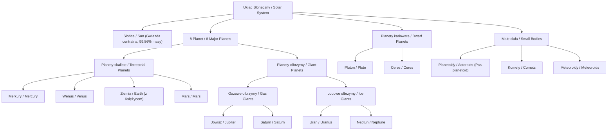
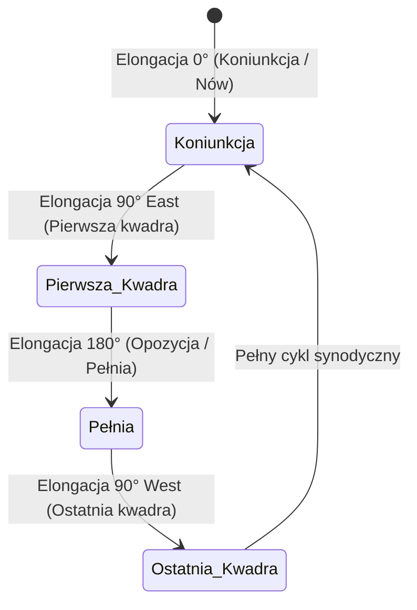
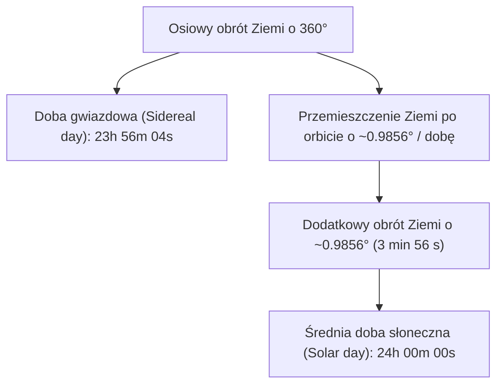
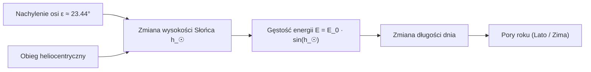
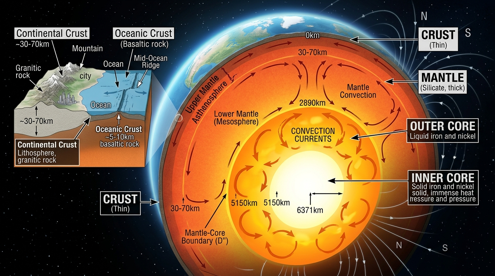
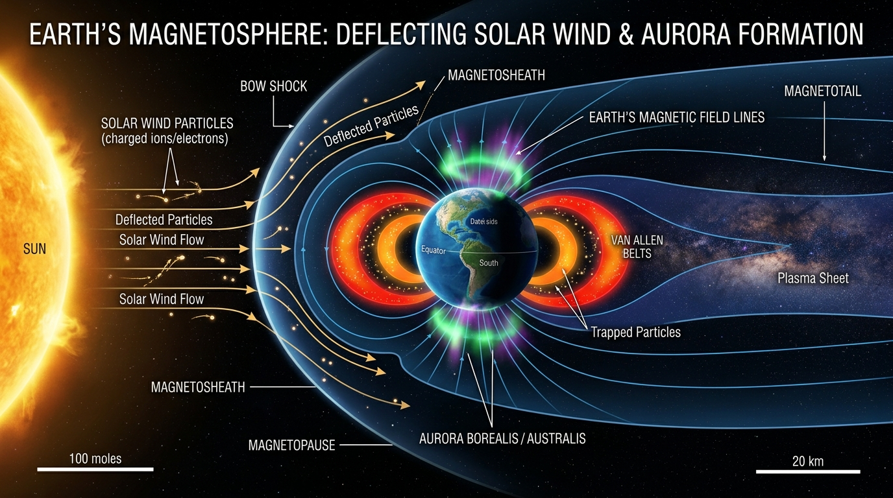
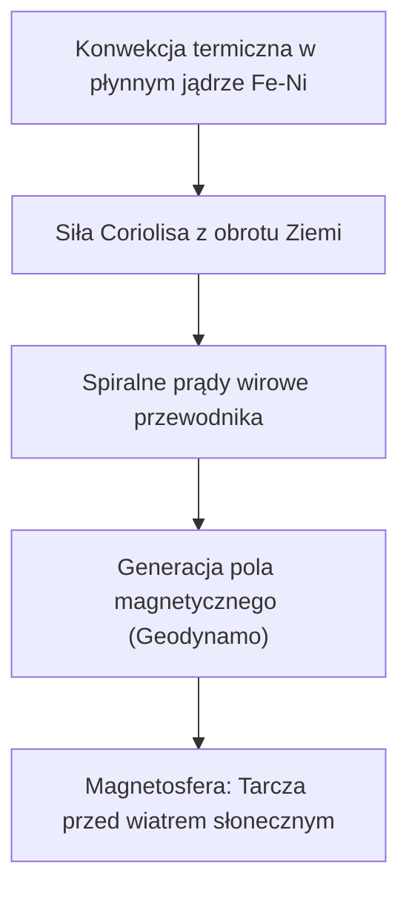

# Учебник по астрономии. Тема 1

## Единство мира. Природа Солнечной системы (*Układ Słoneczny*). Земля (*Ziemia*) — планета. Луна (*Księżyc*) — естественный спутник (*naturalny satelita*)

---

---

### 1. Что нужно понять после изучения темы

После освоения материала вы будете уверенно:

* **Объяснять**, почему Земля — это планета (*planeta*), а Луна — естественный спутник (*naturalny satelita*).
* **Знать** точный порядок и массу планет от Солнца, деление их на планеты земной группы (*planety skaliste / typu ziemskiego*) и планеты-гиганты (*gazowe olbrzymy / lodowe olbrzymy*).
* **Различать** осевое вращение (*obrót wokół własnej osi*) и гелиоцентрическое обращение (*obieg heliocentryczny wokół Słońca*).
* **Понимать** географические координаты и сетку Земли: широта (*szerokość geograficzna*), долгота (*długość geograficzna*), экватор (*równik*), полярные круги (*koła podbiegunowe*) и тропики (*zwrotniki*).
* **Понимать** физический и астрономический смысл эклиптики (*ekliptyka*), её наклон к небесному экватору (*równik niebieski*), точки равноденствий (*punkty równonocy*) и солнцестояний (*przesilenia*), а также зодиакальный пояс (*zodiak*).
* **Объяснять** расчёт звёздных (*doba gwiazdowa*) и солнечных суток (*doba słoneczna*), механику смены дня и ночи (*dzień i noc*), а также истинную астрономическую причину смены времён года (*pory roku*).
* **Понимать** геометрию орбитальных параметров: перигелий (*peryhelium*), афелий (*aphelium*), перигей (*perygeum*), апогей (*apogeum*), эксцентриситет (*mimośród*) и элонгацию (*elongacja*).
* **Знать** эллипсоидальную форму и геометрию радиусов Земли: средний радиус (*promień średni*), экваториальный (*promień równikowy*) и полярный (*promień biegunowy*).
* **Понимать** происхождение и современный точный расчёт Астрономической единицы (*jednostka astronomiczna, au*).
* **Знать** внутреннее строение Земли, физический механизм геодинамо (*geodynamo*) и функцию магнитосферы (*magnetosfera*).
* **Объяснять** смену фаз Луны (*fazy Księżyca*), геометрию солнечных и лунных затмений (*zaćmienie Słońca / Księżyca*), а также возникновение морских приливов и отливов (*przypływ / odpływ*).
* **Применять** фундаментальные законы тяготения Ньютона и III закон Кеплера (*prawa Keplera*) для количественных расчётов орбитальных скоростей и периодов обращения.

---

### 2. Солнечная система — *Układ Słoneczny*

**Солнечная система (*Układ Słoneczny*)** — это гравитационно связанная планетная система (*układ planetarny*), состоящая из центральной звезды — Солнца (*Słońce*) — и всех обращающихся вокруг него по гелиоцентрическим орбитам небесных тел:

* **Солнце (*Słońce*)** — центральное массивное тело системы, сосредоточившее $99{,}86\%$ всей массы Солнечной системы:
  $$\mathbf{M_\odot \approx 1\,988\,500\,000\,000\,000\,000\,000\,000\,000\,000\text{ кг}} \quad (1{,}9885 \cdot 10^{30}\text{ кг})$$
* **8 главных планет (*8 planet*)** — классические планеты, движущиеся по эллиптическим гелиоцентрическим орбитам, близким к круговым.
* **Естественные спутники планет (*naturalne satelity planet*)** — небесные тела, обращающиеся вокруг планет по околопланетным орбитам.
* **Карликовые планеты (*planety karłowate*)** — объекты гидростатического равновесия, не расчистившие свою орбиту (например, Плутон — *Pluton*, Церера — *Ceres*, Эрида — *Eris*).
* **Малые тела Солнечной системы**:
  * **Астероиды (*planetoidy / asteroidy*)** — каменистые малые тела в Главном поясе астероидов (*pas planetoid*) между Марсом и Юпитером ($2{,}1\text{--}3{,}3\text{ au}$).
  * **Кометы (*komety*)** — ледяные малые тела из пояса Койпера (*pas Kuipera*) и облака Оорта (*obłok Oorta*).
  * **Метеороиды (*meteoroidy*)**, метеоры (*meteory*) и метеориты (*meteoryty*).
  * **Межпланетное вещество (*materia międzyplanetarna*)** и солнечный ветер (*wiatr słoneczny*).

---

#### 2.1. Сводная физическая таблица планет Солнечной системы

Точные значения масс (в числах и научной нотации), радиусов, плотностей и ускорений свободного падения:

| Небесное тело | Название по-польски | Масса $M$ (в точных числах кг) | Масса $M / M_\oplus$ | Средний радиус $R$ (км) | Плотность $\rho$ (г/см³) | Ускорение $g$ (м/с²) |
| :--- | :--- | :---: | :---: | :---: | :---: | :---: |
| **Солнце** | *Słońce* | $1\,988\,500\,000\,000\,000\,000\,000\,000\,000\,000$ | $332\,946$ | $696\,340$ | $1{,}408$ | $274{,}0$ |
| **Меркурий** | *Merkury* | $330\,110\,000\,000\,000\,000\,000\,000$ | $0{,}0553$ | $2439{,}7$ | $5{,}427$ | $3{,}70$ |
| **Венера** | *Wenus* | $4\,867\,500\,000\,000\,000\,000\,000\,000$ | $0{,}8150$ | $6051{,}8$ | $5{,}243$ | $8{,}87$ |
| **Земля** | *Ziemia* | $\mathbf{5\,972\,200\,000\,000\,000\,000\,000\,000}$ | $\mathbf{1{,}0000}$ | $\mathbf{6371{,}0}$ | $\mathbf{5{,}515}$ | $\mathbf{9{,}81}$ |
| **Марс** | *Mars* | $641\,710\,000\,000\,000\,000\,000\,000$ | $0{,}1074$ | $3389{,}5$ | $3{,}933$ | $3{,}71$ |
| **Юпитер** | *Jowisz* | $1\,898\,200\,000\,000\,000\,000\,000\,000\,000$ | $317{,}83$ | $69911$ | $1{,}326$ | $24{,}79$ |
| **Сатурн** | *Saturn* | $568\,340\,000\,000\,000\,000\,000\,000\,000$ | $95{,}16$ | $58232$ | $0{,}687$ | $10{,}44$ |
| **Уран** | *Uran* | $86\,810\,000\,000\,000\,000\,000\,000\,000$ | $14{,}54$ | $25362$ | $1{,}270$ | $8{,}69$ |
| **Нептун** | *Neptun* | $102\,410\,000\,000\,000\,000\,000\,000\,000$ | $17{,}15$ | $24622$ | $1{,}638$ | $11{,}15$ |
| **Луна (спутник)**| *Księżyc* | $73\,420\,000\,000\,000\,000\,000\,000$ | $0{,}0123$ ($\frac{1}{81,3}$) | $1737{,}1$ | $3{,}344$ | $1{,}62$ |

---

### 3. Основные географические понятия и сетка координат (*Pojęcia geograficzne*)

Для описания положения объектов на Земле используется градусная сетка координат:

* **Географическая широта (*szerokość geograficzna*, $\varphi$)**: Угловое расстояние от экватора к северу ($\text{N}$, $+0^\circ\text{--}90^\circ$) или к югу ($\text{S}$, $-0^\circ\text{--}90^\circ$).
* **Географическая долгота (*długość geograficzna*, $\lambda$)**: Угловое расстояние от начального (Гринвичского) меридиана к востоку ($\text{E}$, $+0^\circ\text{--}180^\circ$) или к западу ($\text{W}$, $-0^\circ\text{--}180^\circ$).

#### Характерные параллели и регионы Земли:

| Географический объект | Польский термин | Широта $\varphi$ | Астрономический и климатический смысл |
| :--- | :--- | :---: | :--- |
| **Экватор** | *Równik* | $0^\circ$ | Делит Землю на **Северное полушарие (*półkula północna*)** и **Южное полушарие (*półkula południowa*)**. День всегда равен ночи ($12\text{ ч}$). |
| **Тропик Рака (Северный тропик)** | *Zwrotnik Raka* | $+23^\circ 26' \text{ N} \ (\approx 23{,}44^\circ\text{ N})$ | Самая северная широта, где Солнце находится в зените ($h_\odot = 90^\circ$) в день летнего солнцестояния (20–21 июня). |
| **Тропик Козерога (Южный тропик)** | *Zwrotnik Koziorożca* | $-23^\circ 26' \text{ S} \ (\approx 23{,}44^\circ\text{ S})$ | Самая южная широта, где Солнце находится в зените ($h_\odot = 90^\circ$) в день зимнего солнцестояния (21–22 декабря). |
| **Северный полярный круг** | *Północne koło podbiegunowe* | $+66^\circ 34' \text{ N} \ (\approx 66{,}56^\circ\text{ N})$ | Южная граница территории, где наблюдаются **полярный день (*dzień polarny*)** и **полярная ночь (*noc polarna*)**. |
| **Южный полярный круг** | *Południowe koło podbiegunowe* | $-66^\circ 34' \text{ S} \ (\approx 66{,}56^\circ\text{ S})$ | Северная граница полярных явлений в Южном полушарии. |
| **Нулевой меридиан** | *Południk zerowy (Greenwich)* | $\lambda = 0^\circ$ | Начальный меридиан для отсчёта долготы и мирового времени (UTC). |
| **Северный / Южный полюс** | *Biegun północny / południowy* | $+90^\circ\text{ N} \ / \ -90^\circ\text{ S}$ | Точки пересечения оси суточного вращения Земли с её поверхностью. |

---

### 4. Эклиптика Земли (*Ekliptyka Ziemi*)

**Эклиптика (*ekliptyka*)** — ключевое понятие в сферической астрономии:

1. **Для земного наблюдателя**: Это кажущийся годовой путь Солнца по небесной сфере среди звёзд.
2. **Для космического наблюдателя**: Это плоскость орбиты обращения Земли вокруг Солнца (**плоскость эклиптики / *płaszczyzna ekliptyki***).

#### 4.1. Пересечение с небесным экватором и точки равноденствий

Плоскость эклиптики наклонена к плоскости **небесного экватора (*równik niebieski*)** под углом $\varepsilon \approx 23{,}44^\circ$ ($23^\circ 26'$), обусловленным наклоном оси вращения Земли.

Они пересекаются в двух диаметрально противоположных точках:

1. **Точка весеннего равноденствия (*punkt Barana*, $\Upsilon$)**:
   * Солнце пересекает небесный экватор, переходя из Южного полушария небесной сферы в Северное (около 20–21 марта).
   * В этот день на всей Земле день равен ночи ($12\text{ ч}$).
2. **Точка осеннего равноденствия (*punkt Wagi*, $\Omega$)**:
   * Солнце пересекает небесный экватор, переходя из Северного полушария в Южное (около 22–23 сентября).

#### 4.2. Точки солнцестояния (*Przesilenia*)

1. **Летнее солнцестояние (*przesilenie letnie*)**: Точка эклиптики с наибольшим склонением ($+23{,}44^\circ$, около 20–21 июня). В Северном полушарии — самый длинный день и самая короткая ночь.
2. **Зимнее солнцестояние (*przesilenie zimowe*)**: Точка эклиптики с наименьшим склонением ($-23{,}44^\circ$, около 21–22 декабря). В Северном полушарии — самый короткий день.

#### 4.3. Зодиакальный пояс (*Zodiak*) и Лунные узлы

* **Зодиакальный пояс (*pas zodiakalny*)**: Полоса небесной сферы шириной около $16^\circ$ ($8^\circ$ по обе стороны от эклиптики), внутри которой проходят видимые пути Солнца, Луны и всех главных планет Солнечной системы.
* **Созвездия эклиптики**: Солнце на своём пути пересекает 13 созвездий (12 классических зодиакальных созвездий + созвездие **Змееносца / *Wężownik* / Ophiuchus**).
* **Лунные узлы (*węzły Księżyca*)**: Орбита Луны наклонена к плоскости эклиптики под углом $i \approx 5{,}14^\circ$ ($5^\circ 09'$). Две точки пересечения лунной орбиты с эклиптикой называются лунными узлами. **Затмения происходят только тогда, когда Новолуние или Полнолуние совпадают с лунными узлами.**

---

### 5. Астрономическая единица (*Jednostka astronomiczna, au*)

**Астрономическая единица (*jednostka astronomiczna, au*)** — мера расстояния в астрономии, фундаментальный масштаб расстояний в Солнечной системе.

#### 5.1. История происхождения и методы измерения

1. **Древность (Аристарх Самосский, III в. до н.э.)**:
   Аристарх попытался определить отношение расстояний от Земли до Луны и до Солнца, измерив угол между Луной в фазе первой четверти и Солнцем. Из-за несовершенства приборов он получил угол $87^\circ$ (вместо истинных $89^\circ 50'$), сделав вывод, что Солнце дальше Луны в 19 раз (на самом деле — в 390 раз).

2. **Законы Кеплера (XVII век)**:
   Открыв III закон Кеплера ($\frac{a_1^3}{a_2^3} = \frac{T_1^2}{T_2^2}$), Иоганн Кеплер смог построить точную относительную карту Солнечной системы. Астрономы узнали расстояния до всех планет **в астрономических единицах** (например, Марс — $1{,}52\text{ au}$, Юпитер — $5{,}20\text{ au}$), однако абсолютная величина $1\text{ au}$ в километрах оставалась неизвестной. Достаточно было измерить в километрах расстояние до *одной* планеты, чтобы узнать масштабы всей системы.

3. **Метод тригонометрического параллакса (Джованни Кассини и Жан Рише, 1672 г.)**:
   Во время великого противостояния Марса 1672 года Кассини измерял положение Марса в Париже, а Рише — в Кайенне (Французская Гвиана, Южная Америка). Составив базисный треугольник с известной хордой Земли, они впервые вычислили солнечный параллакс $\pi_\odot \approx 9,5''$ и получили абсолютное значение: $1\text{ au} \approx 140\text{ млн км}$.

4. **Радиолокационные измерения (XX век)**:
   В 1961 году радиолокация Венеры в момент её нижнего соединения позволила измерить задержку отражённого радиосигнала с точностью до долей миллисекунды, определив $1\text{ au} = 149\,597\,870\text{ км} \pm 1\text{ км}$.

#### 5.2. Точное современное определение (IAU 2012)

В 2012 году на XXVIII Генеральной ассамблее Международного астрономического союза (МАС / IAU) в Пекине астрономическая единица была окончательно переведена из категории вычисляемых параметров в статус **точного фундаментального константного значения**:

$$\mathbf{1\text{ au} = 149\,597\,870\,700\text{ метров} \approx 149{,}6\text{ млн км} \approx 1{,}496 \cdot 10^{11}\text{ м}}$$

---

### 6. Основные астрономические термины (*Pojęcia astronomiczne*)

| Русский термин | Термин по-польски | Астрофизическое определение |
| :--- | :--- | :--- |
| **Солнце** | *Słońce* | Звезда спектрального класса G2V, гравитационный и энергетический центр системы. |
| **Земля** | *Ziemia* | Третья планета от Солнца, крупнейшая из каменистых планет. |
| **Луна** | *Księżyc* | Единственный естественный спутник Земли, находящийся в приливном захвате. |
| **Гелиоцентрическая орбита** | *orbita heliocentryczna* | Траектория движения небесного тела вокруг Солнца как главного центра масс. |
| **Эклиптика** | *ekliptyka* | Плоскость орбиты Земли (или видимый годовой путь Солнца по небесной сфере). |
| **Наклон оси вращения** | *nachylenie osi obrotu* | Угол между осью суточного вращения и перпендикуляром (нормалью) к плоскости орбиты ($\varepsilon \approx 23{,}44^\circ$). |
| **Перигелий** | *peryhelium* | Ближайшая к Солнцу точка гелиоцентрической орбиты ($r_{\text{min}} = a(1-e)$). |
| **Афелий** | *aphelium* | Наиболее удалённая от Солнца точка гелиоцентрической орбиты ($r_{\text{max}} = a(1+e)$). |
| **Перигей** | *perygeum* | Ближайшая к центру Земли точка околоземной (геоцентрической) орбиты Луны или ИСЗ. |
| **Апогей** | *apogeum* | Наиболее удалённая от центра Земли точка околоземной орбиты. |
| **Перицентр / Апоцентр** | *perycentrum / apocentrum* | Обобщённые наименования ближайшей и дальней точек орбиты относительно главного фокуса. |
| **Эксцентриситет орбиты** | *mimośród / ekscentryczność* | Безразмерная мера вытянутости эллипса ($e = c/a = \sqrt{1 - b^2/a^2}$). |
| **Элонгация** | *elongacja* | Угловое расстояние между Солнцем и планетным телом (или Луной) при наблюдении с Земли. |
| **Прилив и отлив** | *przypływ i odpływ* | Периодические колебания уровня океана, вызванные градиентом гравитации Луны и Солнца. |
| **Солнечное затмение** | *zaćmienie Słońca* | Явление, при котором диск Луны перекрывает Солнце для земного наблюдателя. |
| **Лунное затмение** | *zaćmienie Księżyca* | Погружение Луны в конус тени, отбрасываемый Землёй. |

---

### 7. Геометрия орбит и параметров: Перигелий, Афелий, Эксцентриситет

Точки наименьшего и наибольшего расстояния от фокуса называют **апсидами (*apsydy*)**:

1. **Перицентр (*perycentrum*)**: Точка орбиты, ближайшая к центральному телу.
   * Для Солнца — **перигелий (*peryhelium*)**: $r_{\text{min}} = a(1-e)$
   * Для Земли — **перигей (*perygeum*)**: $r_{\text{min}} = a(1-e)$
2. **Апоцентр (*apocentrum*)**: Точка орбиты, наиболее удаленная от центрального тела.
   * Для Солнца — **афелий (*aphelium*)**: $r_{\text{max}} = a(1+e)$
   * Для Земли — **апогей (*apogeum*)**: $r_{\text{max}} = a(1+e)$
3. **Эксцентриситет эллипса (*mimośród / ekscentryczność*)**:
   $$e = \frac{c}{a} = \sqrt{1 - \frac{b^2}{a^2}} = \frac{r_{\text{max}} - r_{\text{min}}}{r_{\text{max}} + r_{\text{min}}}$$
   где $a$ — большая полуось, $b$ — малая полуось, $c$ — фокальное расстояние.
   * Если $e = 0$ — орбита строго круговая.
   * Если $0 < e < 1$ — эллиптическая орбита (для Земли $e \approx 0{,}0167$).

---

### 8. Элонгация (*Elongacja*) и конфигурации планет

**Элонгация (*elongacja*)** — это угловое расстояние между Солнцем и планетным телом (или Луной), наблюдаемое с Земли.

#### Характерные углы элонгации:

* **Соединение (*koniunkcja*) — элонгация $0^\circ$**: Светило находится на одной линии с Солнцем. В случае Луны — фаза **новолуние (*nów*)**.
* **Восточная элонгация $90^\circ\text{ E}$**: Светило находится на $90^\circ$ к востоку от Солнца. Видно вечером после заката. Для Луны — фаза **первая четверть (*pierwsza kwadra*)**.
* **Противостояние (*opozycja*) — элонгация $180^\circ$**: Светило находится на противоположной стороне неба от Солнца. Для Луны — фаза **полнолуние (*pełnia*)**. Видно всю ночь.
* **Западная элонгация $90^\circ\text{ W}$**: Светило находится на $90^\circ$ к западу от Солнца. Видно утром перед восходом. Для Луны — фаза **последняя четверть (*ostatnia kwadra*)**.
* **Максимальная элонгация внутренних планет (*maksymalna elongacja*)**: Внутренние планеты (Меркурий и Венера) не могут уходить на угол $180^\circ$. Их максимальный угловой уход ограничен орбитой:
  * Меркурий: $\psi_{\text{max}} \approx 18^\circ\text{--}28^\circ$
  * Венера: $\psi_{\text{max}} \approx 45^\circ\text{--}48^\circ$

---

### 9. Форма и радиусы Земли (*Promienie Ziemi*)

Из-за суточного вращения центробежная сила придает Земле форму **сплюснутого эллипсоида вращения (геоида / сплюснутого сфероида)**:

1. **Экваториальный радиус (*promień równikowy*)**:
   $$R_{\text{eq}} \approx 6378{,}137\text{ км}$$
2. **Полярный радиус (*promień biegunowy*)**:
   $$R_{\text{pol}} \approx 6356{,}752\text{ км}$$
3. **Средний радиус Земли (*promień średni Ziemi*)**:
   Объёмно-эквивалентный радиус сферы:
   $$R_\oplus = \sqrt[3]{R_{\text{eq}}^2 \cdot R_{\text{pol}}} \approx 6371{,}0008\text{ км} \approx 6371\text{ км}$$
4. **Полярное сжатие (эллиптичность / *spłaszczenie biegunowe*)**:
   $$f = \frac{R_{\text{eq}} - R_{\text{pol}}}{R_{\text{eq}}} = \frac{6378{,}137 - 6356{,}752}{6378{,}137} \approx \frac{1}{298{,}257} \approx 0{,}003353$$

---

### 10. Расчёт суток в астрономии: Звёздные и Солнечные сутки (*Doba gwiazdowa a doba słoneczna*)

В астрономии строго различают два типа суток в зависимости от точки отсчёта:

#### 10.1. Звёздные сутки (*Doba gwiazdowa*)

* **Определение**: Промежуток времени между двумя последовательными верхними кульминациями точки весеннего равноденствия (или бесконечно удалённой звезды).
* **Физический смысл**: Время полного оборота Земли вокруг своей оси на ровно $360^\circ$ относительно инерциальной системы отсчёта.
* **Точная продолжительность**:
  $$T_{\text{sid}} = 23^{\text{h}} 56^{\text{m}} 04{,}0905^{\text{s}} = 86164{,}0905\text{ секунд}$$

#### 10.2. Средние солнечные сутки (*Doba słoneczna*)

* **Определение**: Промежуток времени между двумя последовательными нижними (или верхними) кульминациями среднего экваториального Солнца.
* **Физический смысл**: Время, за которое Земля совершает поворот относительно Солнца.
* **Точная продолжительность**:
  $$T_{\text{sol}} = 24^{\text{h}} 00^{\text{m}} 00^{\text{s}} = 86400\text{ секунд}$$

#### 10.3. Почему солнечные сутки длиннее звёздных на 3 мин 56 с?

Пока Земля совершает оборот вокруг своей оси ($360^\circ$), она одновременно перемещается по гелиоцентрической орбите вокруг Солнца. За один полный год ($T_{\text{rev}} \approx 365{,}2564\text{ суток}$) Земля проходит угол $360^\circ$.

За одни сутки угловое смещение Земли по орбите составляет:

$$\Delta \theta = \frac{360^\circ}{365{,}2564} \approx 0{,}9856^\circ \approx 59' 08''$$

Чтобы Солнце снова оказалось на том же географическом меридиане, Земля должна повернуться на угол $360^\circ + 0{,}9856^\circ \approx 360{,}9856^\circ$.

Время, необходимое для доворота на $\Delta \theta = 0{,}9856^\circ$:

$$\Delta t = \frac{0{,}9856^\circ}{360^\circ} \times 86400\text{ с} \approx 236{,}55\text{ с} \approx 3\text{ мин } 56\text{ с}$$

#### Математическая связь между периодами:

$$\frac{1}{T_{\text{sol}}} = \frac{1}{T_{\text{sid}}} - \frac{1}{T_{\text{rev}}}$$

---

### 11. Вращение и гелиоцентрическое обращение

Принципиальное кинематическое различие:

* **Осевое вращение (*obrót wokół własnej osi*)**:
  * Суточное вращение вокруг полярной оси.
  * *Следствие*: смена дня и ночи (*dzień i noc*), кажущееся суточное движение небесной сферы.

* **Гелиоцентрическое обращение (*obieg heliocentryczny wokół Słońca*)**:
  * Движение центра масс Земли по эллиптической гелиоцентрической орбите вокругу Солнца.
  * Период — **звёздный год (*rok gwiazdowy*)**: $T \approx 365{,}2564\text{ суток}$.

$$\text{Вращение (obrót)} \longrightarrow \text{день и ночь (dzień i noc)}$$
$$\text{Обращение (obieg)} + \text{наклон оси (nachylenie osi)} \longrightarrow \text{времена года (pory roku)}$$

---

### 12. Времена года и Высота Солнца над горизонтом

* ❌ **Ошибочное мнение**: «Летом жарко, потому что Земля находится ближе к Солнцу».
* ✅ **Астрономический факт**: В начале января (около 3 января) Земля проходит **перигелий (*peryhelium*)** ($r_{\text{min}} \approx 147{,}1\text{ млн км}$). В начале июля (около 4 июля) Земля проходит **афелий (*aphelium*)** ($r_{\text{max}} \approx 152{,}1\text{ млн км}$).
* ✅ **Истинная причина**: Наклон оси вращения Земли к нормали плоскости эклиптики на угол $\varepsilon \approx 23{,}44^\circ$ ($23^\circ 26'$).

Поток лучистой энергии (*strumień promieniowania*):

$$E = E_0 \cdot \sin h_\odot$$

где $E_0 \approx 1361\text{ Вт/м}^2$ — солнечная постоянная, $h_\odot$ — угловая высота Солнца.

---

### 13. Внутреннее строение Земли, Геодинамо и Магнитосфера

1. **Земная кора (*skorupa ziemska*)**: Океаническая ($5\text{--}10\text{ км}$) и континентальная ($30\text{--}70\text{ км}$).
2. **Мантия Земли (*płaszcz Ziemi*)**: Силикатная толща глубиной до $2900\text{ км}$ с термической конвекцией.
3. **Ядро Земли (*jądro Ziemi*)**:
   * **Внешнее ядро (*jądro zewnętrzne*)**: Жидкий слой расплава Fe-Ni толщиной около $2200\text{ км}$.
   * **Внутреннее ядро (*jądro wewnętrzne*)**: Твёрдая сфера ($R \approx 1220\text{ км}$) при температуре $\sim 5400^\circ\text{C}$.

#### Эффект геодинамо (*geodynamo*):

---

### 14. Луна — естественный спутник (*Księżyc*)

#### 14.1. Физические параметры Луны

* **Масса Луны (*masa Księżyca*)**: $M_{\text{Moon}} \approx 73\,420\,000\,000\,000\,000\,000\,000\text{ кг} \approx 7{,}342 \cdot 10^{22}\text{ кг} \approx \frac{1}{81,3} M_\oplus$
* **Радиус (*promień*)**: $R_{\text{Moon}} \approx 1737{,}1\text{ км} \approx 0{,}2727 R_\oplus$
* **Ускорение свободного падения**: $g_{\text{Moon}} \approx 1{,}62\text{ м/с}^2 \approx \frac{1}{6} g_\oplus$
* **Период обращения (*okres obiegu*)**:
  * **Сидерический месяц (*miesiąc gwiazdowy*)**: $T_{\text{sid}} \approx 27{,}3217\text{ сут}$
  * **Синодический месяц (*miesiąc synodyczny*)**: $S \approx 29{,}5306\text{ сут}$

$$\frac{1}{S} = \frac{1}{T_{\text{sid}}} - \frac{1}{T_\oplus}$$

#### 14.2. Синхронное вращение и приливы

Период осевого вращения Луны равен периоду обращения ($T_{\text{obrotu}} = T_{\text{obiegu}} = 27{,}32\text{ сут}$), из-за чего Луна находится в приливном захвате. Приливное трение океанов приводит к отдалению Луны на $\approx 3{,}8\text{ см/год}$ и замедлению вращения Земли.

---

### 15. Математический аппарат и законы механики (*Aparat matematyczny*)

В данном разделе собраны фундаментальные законы небесной механики с расширенным описанием каждого физического параметра и единиц измерения СИ (SI):

#### 15.1. Закон всемирного тяготения Ньютона (*Prawo powszechnego ciążenia Newtona*)

$$F = G \frac{M m}{r^2}$$

* **Теоретическое пояснение**: Описывает силу гравитационного притяжения между двумя точечными массами или сферически симметричными телами.
* **Переменные и величины**:
  * $F$ — сила гравитационного притяжения [Ньютоны, $\text{Н} / \text{N}$].
  * $G = 6{,}67430 \cdot 10^{-11}\text{ Н}\cdot\text{м}^2/\text{кг}^2$ — гравитационная постоянная (*stała grawitacji*).
  * $M$ — масса центрального крупного тела (Солнца или планеты) [килограммы, $\text{кг} / \text{kg}$].
  * $m$ — масса второго тела или спутника [килограммы, $\text{кг} / \text{kg}$].
  * $r$ — расстояние между центрами масс двух тел [метры, $\text{м} / \text{m}$].

#### 15.2. Ускорение свободного падения (*Przyspieszenie grawitacyjne*)

$$g = \frac{G M}{R^2}$$

* **Теоретическое пояснение**: Ускорение, которое приобретает любое тело под действием гравитационного поля планеты на её поверхности.
* **Переменные и величины**:
  * $g$ — ускорение свободного падения [метры на секунду в квадрате, $\text{м/с}^2 / \text{m/s}^2$]. Для Земли $g_\oplus \approx 9{,}81\text{ м/с}^2$.
  * $R$ — средний радиус планеты или небесного тела [метры, $\text{м} / \text{m}$].

#### 15.3. Первая космическая скорость (*Pierwsza prędkość kosmiczna / prędkość kołowa*)

$$v_{\text{I}} = \sqrt{\frac{G M}{R}} = \sqrt{g R}$$

* **Теоретическое пояснение**: Минимальная линейная скорость, которую необходимо придать телу, чтобы оно стало искусственным спутником планеты и двигалось по круговой орбите вблизи её поверхности.
* **Переменные и величины**:
  * $v_{\text{I}}$ — первая космическая скорость [метры в секунду, $\text{м/с}$ или $\text{км/с}$]. Для Земли $v_{\text{I}} \approx 7{,}91\text{ км/с}$.

#### 15.4. Вторая космическая скорость (*Druga prędkość kosmiczna / prędkość ucieczki*)

$$v_{\text{II}} = \sqrt{\frac{2 G M}{R}} = \sqrt{2} \cdot v_{\text{I}}$$

* **Теоретическое пояснение**: Минимальная параболическая скорость для преодоления гравитационного притяжения планеты и ухода в бесконечность.
* **Переменные и величины**:
  * $v_{\text{II}}$ — вторая космическая скорость (скорость ухода / параболическая). Для Земли $v_{\text{II}} \approx 11{,}19\text{ км/с} \approx 11{,}2\text{ км/с}$.

#### 15.5. III закон Кеплера (*III prawo Keplera*)

$$\frac{T_1^2}{T_2^2} = \frac{a_1^3}{a_2^3} \quad \Longleftrightarrow \quad T^2 = a^3 \quad (\text{при } a \text{ в [au] и } T \text{ в земных годах})$$

* **Теоретическое пояснение**: Квадраты периодов обращения планет вокруг Солнца относятся как кубы больших полуосей их орбит.
* **Переменные и величины**:
  * $T_1, T_2$ — периоды обращения небесных тел по гелиоцентрическим орбитам [годы, $\text{lata}$ или секунд].
  * $a_1, a_2$ — большие полуоси орбит [астрономические единицы, $\text{au}$ или метры].

#### 15.6. Закон плотности потока излучения / Инсоляции (*Strumień promieniowania*)

$$E = E_0 \cdot \sin h_\odot$$

* **Теоретическое пояснение**: Зависимость приходящей солнечной энергии на единичную площадку от угла возвышения Солнца над горизонтом.
* **Переменные и величины**:
  * $E$ — плотность падающего потока энергии [Ватты на квадратный метр, $\text{Вт/м}^2 / \text{W/m}^2$].
  * $E_0 \approx 1361\text{ Вт/м}^2$ — солнечная постоянная (*stała słoneczna*).
  * $h_\odot$ — угловая высота Солнца над горизонтом [градусы, $^\circ$].

---

### 16. Задачи для самостоятельного решения (*Zadania do samodzielnego rozwiązania*)

> *(Примечание: Все подробные решения и ответы вынесены в специальный итоговый **Раздел 18** в конце учебника. Сначала попробуйте решить задачи самостоятельно!)*

#### Задача 1. Расчёт ускорения свободного падения на поверхности Земли
Вычислить теоретическое ускорение свободного падения $g_\oplus$ на поверхности Земли, приняв $M_\oplus = 5\,972\,200\,000\,000\,000\,000\,000\,000\text{ кг}$, средний радиус $R_\oplus = 6371\text{ км}$ и $G = 6{,}67430 \cdot 10^{-11}\text{ Н}\cdot\text{м}^2/\text{кг}^2$.

#### Задача 2. Линейная скорость геостационарного спутника
Искусственный спутник Земли (*sztuczny satelita Ziemi*) движется по круговой орбите на геоцентрическом расстоянии $r = 42\,000\text{ км}$ от центра планеты. Найти его линейную скорость $v$.

#### Задача 3. Применение III закона Кеплера для астероида
Астероид Главного пояса движется вокруг Солнца по круговой орбите с большой полуосью $a = 4\text{ au}$. Определить период обращения астероида $T$ в земных годах.

---

### 17. Контрольные вопросы для самопроверки (*Pytania kontrolne*)

> *(Примечание: Ответы на все вопросы приведены в **Разделе 18** в конце учебника.)*

#### Базовый уровень
1. Что такое планета (*planeta*) и чем она фундаментально отличается от естественного спутника (*naturalny satelita*)?
2. Какова масса Солнца в килограммах точным числом без использования степеней 10?
3. Что такое астрономическая единица (*au*) и чему равна её точная фиксированная длина по решению IAU 2012?
4. Что такое эклиптика (*ekliptyka*) и под каким углом она наклонена к небесному экватору?
5. Назовите географический и астрономический смысл Тропика Рака (*Zwrotnik Raka*) и Северного полярного круга (*Północne koło podbiegunowe*).

#### Средний уровень
6. Почему солнечные сутки (*doba słoneczna*) длиннее звёздных суток (*doba gwiazdowa*) ровно на 3 минуты 56 секунд? Выведите этот интервал математически.
7. В чём состоит принципиальное различие между перигелием (*peryhelium*) и перигеем (*perygeum*)?
8. Что такое элонгация (*elongacja*) и почему максимальная элонгация Венеры не может превышать $48^\circ$?
9. Чему равны экваториальный ($R_{\text{eq}}$), полярный ($R_{\text{pol}}$) и средний ($R_\oplus$) радиусы Земли, а также полярное сжатие ($f$)?

---

### 18. Раздел решений задач и ответов (*Rozwiązania zadań i Odpowiedzi*)

#### 18.1. Подробные решения задач из Раздела 16

* **Решение Задачи 1 (Расчёт $g_\oplus$)**:
  1. Переведём радиус в СИ: $R_\oplus = 6371\text{ км} = 6{,}371 \cdot 10^6\text{ м}$.
  2. Применяем формулу: $g = \frac{G M_\oplus}{R_\oplus^2}$.
  3. Вычисляем:
     $$g = \frac{6{,}67430 \cdot 10^{-11} \cdot 5{,}9722 \cdot 10^{24}}{(6{,}371 \cdot 10^6)^2} = \frac{39{,}8595 \cdot 10^{13}}{40{,}5896 \cdot 10^{12}} \approx 9{,}819\text{ м/с}^2$$
  * **Ответ**: $\mathbf{g_\oplus \approx 9{,}81\text{ м/с}^2}$.

* **Решение Задачи 2 (Скорость спутника $v$)**:
  1. Расстояние от центра планеты: $r = 42\,000\text{ км} = 4{,}2 \cdot 10^7\text{ м}$.
  2. Формула первой космической скорости: $v = \sqrt{\frac{G M_\oplus}{r}}$.
  3. Вычисляем:
     $$v = \sqrt{\frac{6{,}67430 \cdot 10^{-11} \cdot 5{,}9722 \cdot 10^{24}}{4{,}2 \cdot 10^7}} = \sqrt{9{,}4903 \cdot 10^6} \approx 3080{,}6\text{ м/с} \approx 3{,}08\text{ км/с}$$
  * **Ответ**: $\mathbf{v \approx 3{,}08\text{ км/с}}$.

* **Решение Задачи 3 (III закон Кеплера)**:
  1. Для $a$ в $[\text{au}]$ и $T$ в годах: $T^2 = a^3$.
  2. Подставляем $a = 4$: $T^2 = 4^3 = 64$.
  3. Извлекаем корень: $T = \sqrt{64} = 8\text{ лет}$.
  * **Ответ**: $\mathbf{T = 8\text{ лет}}$.

---

#### 18.2. Ответы на контрольные вопросы из Раздела 17

1. **Планета vs Спутник**: Планета вращается напрямую вокруг звезды и расчистила свою орбиту; естественный спутник вращается вокруг планеты.
2. **Точная масса Солнца**: $1\,988\,500\,000\,000\,000\,000\,000\,000\,000\,000\text{ кг}$.
3. **Длина 1 au**: Ровно $149\,597\,870\,700\text{ метров}$.
4. **Эклиптика**: Видимый путь Солнца по небесной сфере (плоскость земной орбиты). Наклонена к небесному экватору под углом $\varepsilon \approx 23{,}44^\circ$.
5. **Тропик Рака и Полярный круг**: Тропик Рака ($23{,}44^\circ\text{ N}$) — широта зенита Солнца в летнее солнцестояние; Полярный круг ($66{,}56^\circ\text{ N}$) — граница полярного дня и ночи.
6. **Вывод разницы суток**: За солнечные сутки Земля смещается по орбите на $\Delta \theta = \frac{360^\circ}{365{,}2564} \approx 0{,}9856^\circ$. Время доворота Земли: $\Delta t = \frac{0{,}9856^\circ}{360^\circ} \times 86400\text{ с} \approx 236{,}55\text{ с} \approx 3\text{ мин } 56\text{ с}$.
7. **Перигелий vs Перигей**: Перигелий — ближайшая точка гелиоцентрической орбиты (вокруг Солнца); перигей — ближайшая точка геоцентрической орбиты (вокруг Земли).
8. **Элонгация Венеры**: Элонгация — угловое расстояние от Солнца. Максимальный угол ограничен орбитой Венеры внутри орбиты Земли ($\sin \psi_{\text{max}} = \frac{a_{\text{Ven}}}{a_\oplus} \approx \frac{0{,}723}{1{,}000} \implies \psi_{\text{max}} \approx 46^\circ\text{--}48^\circ$).
9. **Радиусы Земли и сжатие**: $R_{\text{eq}} \approx 6378{,}1\text{ км}$, $R_{\text{pol}} \approx 6356{,}8\text{ км}$, $R_\oplus \approx 6371{,}0\text{ км}$, $f = \frac{R_{\text{eq}} - R_{\text{pol}}}{R_{\text{eq}}} \approx \frac{1}{298{,}25}$.
